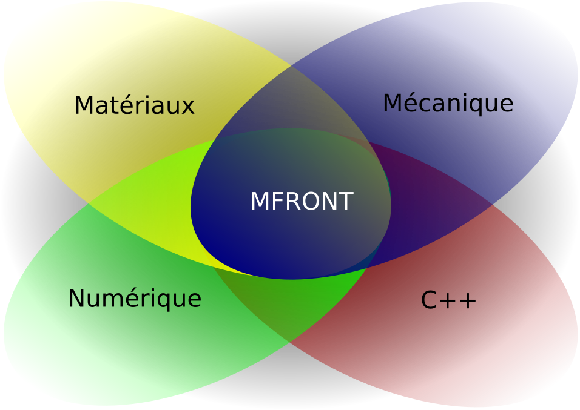
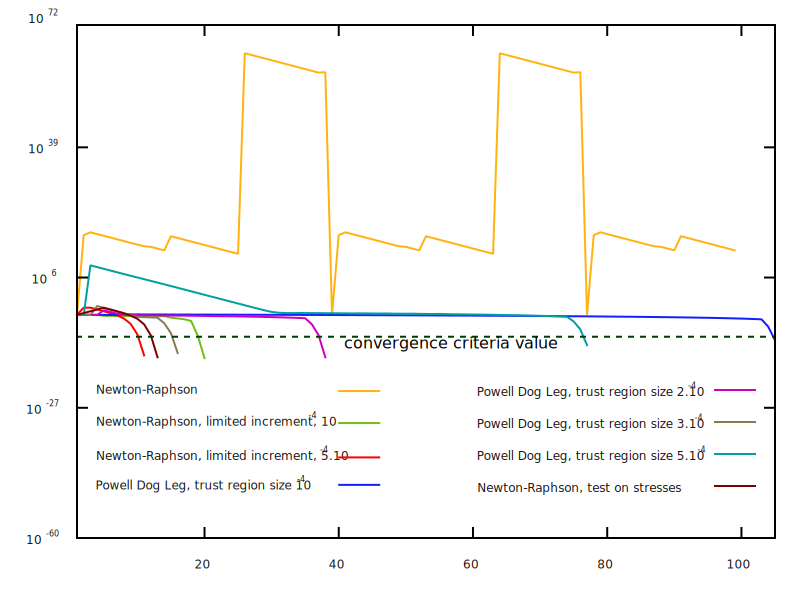
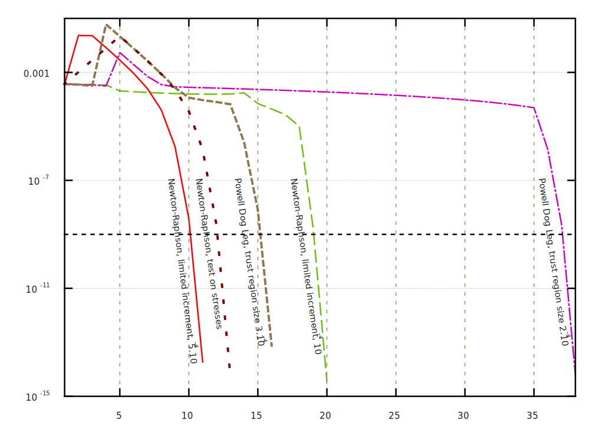
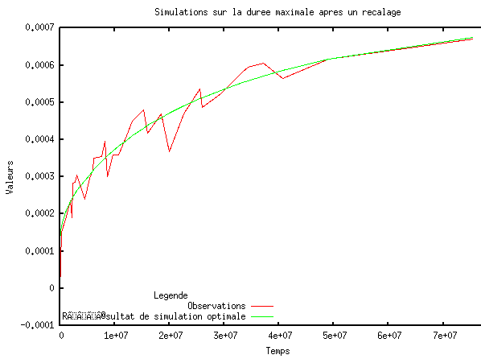

% MFront User Meeting:
  TFEL \(2.0\) and beyond
% Thomas Helfer
% 2014

\newcommand{\tenseur}[1]{\underline{#1}}
\newcommand{\tenseurq}[1]{\underline{\mathbf{#1}}}
\newcommand{\tns}[1]{\underset{\tilde{}}{\mathbf{#1}}}
\newcommand{\transpose}[1]{#1^{\mathop{T}}}

\newcommand{\tsigma}{\underline{\sigma}}
\newcommand{\sigmaeq}{\sigma_{\mathrm{eq}}}
\newcommand{\sigmaz}{\sigma_{zz}}

\newcommand{\epsilonth}{\epsilon^{\mathrm{th}}}

\newcommand{\tepsilonto}{\underline{\epsilon}^{\mathrm{to}}}
\newcommand{\tepsilonel}{\underline{\epsilon}^{\mathrm{el}}}
\newcommand{\tepsilonth}{\underline{\epsilon}^{\mathrm{th}}}
\newcommand{\tdepsilonto}{\underline{\dot{\epsilon}}^{\mathrm{to}}}

\newcommand{\tepsilonvis}{\underline{\epsilon}^{\mathrm{vis}}}
\newcommand{\tdepsilonvis}{\underline{\dot{\epsilon}}^{\mathrm{vis}}}

\newcommand{\tepsilonp}{\underline{\epsilon}^{\mathrm{p}}}
\newcommand{\tdepsilonp}{\underline{\dot{\epsilon}}^{\mathrm{p}}}

\newcommand{\talpha}{\underline{\alpha}}
\newcommand{\tdalpha}{\underline{\dot{\alpha}}}
\newcommand{\txi}{\underline{\xi}}
\newcommand{\tdxi}{\underline{\dot{\xi}}}

\newcommand{\tDq}{\underline{\mathbf{D}}}
\newcommand{\trace}[1]{\mathrm{tr}\paren{#1}}
\newcommand{\Frac}[2]{{\displaystyle \frac{\displaystyle #1}{\displaystyle #2}}}
\newcommand{\deriv}[2]{{\displaystyle \frac{\displaystyle \partial #1}{\displaystyle \partial #2}}}
\newcommand{\dtot}{{\mathrm{d}}}
\newcommand{\paren}[1]{\left(#1\right)}
\newcommand{\nom}[1]{\textsc{#1}}
\newcommand{\bts}[1]{\left.#1\right|_{t}}
\newcommand{\mts}[1]{\left.#1\right|_{t+\theta\,\Delta\,t}}
\newcommand{\ets}[1]{\left.#1\right|_{t+\Delta\,t}}

# TFEL is now *open-sourced* !

## A brand new logo

## Licences

- To meet [CEA](http://www.cea.fr/) and [EDF](http://www.edf.com/)
  needs, TFEL \(2.0\) is released under a multi-licensing scheme:
    - contaminating open-source licences
	    - [GNU Public License](http://www.gnu.org/licenses/gpl-3.0.txt). 
		  This licence is used by the
          [Code-Aster](http://www.code-aster.org) finite element
          solver.
		- [CECILL-A](http://www.cecill.info/). License developped by
          [CEA](http://www.cea.fr/), [EDF](http://www.edf.com/) and
          [INRIA](http://www.inria.fr/), compatible with the
          [GNU Public License](http://www.gnu.org/licenses/gpl-3.0.txt) and
		  designed for conformity with the French law.
	- **[CEA](http://www.cea.fr/) and [EDF](http://www.edf.com/) are
      free to distribute TFEL under custom licences.**
		- Mandatory for the PLEIADES plateform

## Access to TFEL repository

- svn address: <https://svn-pleiades.cea.fr/SVN/TFEL/trunk>
- TRAC:
 

# Current status

## Interfaces to mechanical behaviours

- `umat` for the [CEA](http://www.cea.fr/)'s
  [Cast3M](http://www-cast3m.cea.fr/) finite element solver
- `aster` for the [EDF](http://www.edf.com/)'s
  [Code-Aster](http://www.code-aster.org) finite element
  solver
- `cyrano` for the Cyrano3 fuel performance code.
- `zmat` for the [Zebulon](www.zset-software.com/products/zebulon/)
  finite elemnet solver developed by the
  [École des Mines ParisTech](http://www.mines-paristech.fr/)
  (France), [Onera](http://www.onera.fr),
  [NW Numerics & Modeling](http://www.nwnumerics.com), Inc (USA) and
  various academic partners.

## New algorithms for the Implicit parser

- introduction of the class `MFrontNonLinearSolver`
   - new algorithms can easily be added
- increasing the robutness of the standard Newton-Raphson schemes:
    - limiting the size of the increments (`@MaximumIncrementValuePerIteration 1.e-4;`)
    - return `false` in `@Integrator`
    - coupling Newton-Raphson and the Gauss method through a simplified
      Powell's dogleg algorithm (constant trust-region size)
- new algorithm:
    - Levenberg-Marquart

## Increased robustness - 1

## Increased robustness - 2

## Finite strain strategies in [Cast3M](http://www-cast3m.cea.fr/)

~~~~ {.cpp}
@UMATFiniteStrainStrategies[umat] {None,FiniteRotationSmallStrain,
                                   MieheApelLambrechtLogarithmicStrain};
~~~~~~~~~~~~~~~~~~~~~~~~~~~~~~~~~~~~~~~~~~~~~~~~~~~~~~~~~~~~~~~~~~~~~~~~

- small strain formalism can be reused to build *consistent* finite
  strain behaviours.
- two lagrangian finite strain strategies are available:
    - finite rotation, small deformation (available in
      [Code-Aster](http://www.code-aster.org), [see @edf_loi_2013]
	- logarithmic strains based on Miehe et al
      [see @miehe_anisotropic_2002]. Available in
      [Code-Aster](http://www.code-aster.org)
      [see @edf_modeles_2013] and
      [Zebulon](www.zset-software.com/products/zebulon/).
- restriction : swelling and thermal expansion must be taken into
  account within the behaviour for portability between codes.

## Logarithmic strains - Principle

- \(\tenseur{T}\) is the dual of the logarithmic strain
  \(\tepsilonto{}_{\text{log}}\)
    - \(P=\tenseur{T}\,\colon\,\tdepsilonto{}_{\text{log}}=\tenseur{S}\,\colon\,\tdepsilonto{}_{\text{GL}}\)

- if the small strain behaviour is **thermodynamically consistent**, so
  does the corresponding finite strain behaviour.
- the behaviour is **objective** due to its lagrangian nature.
- **no restriction** on the small strain behaviour (initial and
  induced **orthotropy** can be handled appropriately: application to
  Zircaloy ?)
    - much more appealing than the hypoelastic
      [Cast3M](http://www-cast3m.cea.fr/) formulation
- *drawbacks:* the pre- and post-processing stage are non trivial and
  may have a significant computation costs.

## Logarithmic strains - Examples

- up to \(70\%\) of deformation
- validation by comparison to [Code-Aster](http://www.code-aster.org)

## Logarithmic strains - 1D simulations

fuel performance code are written using small strain formalism but can
be adapted to use the logarithmic strains:
\(\begin{aligned}
  \tepsilonto_{HPP}&=\frac{1}{2}\left[\vec{\nabla}\,\vec{u}+\mbox{}^{tr}\vec{\nabla}\,\vec{u}\right]=\vec{\nabla}\,\vec{u} \\
  \tns{F}&=\tenseur{I}+\tepsilonto_{HPP} \rightarrow \tns{\dot{F}}=\tdepsilonto_{HPP} \\
  \left.\epsilon^{\text{log}}_{\text{log}}\right|_{rr} &= \log\,\paren{1+\left.\epsilon^{\text{to}}_{\text{log}}\right|_{rr}} \\
  \sigma_{rr} &= \Frac{1}{\mathop{det}\paren{F}}\,T_{rr}
\end{aligned}\)

## Plane stress and generalised plane stress in Implicit Parser

~~~~ {.cpp}
@ModellingHypotheses {".+"};
...
@StateVariable<PlaneStress> real etozz;
PlaneStress::etozz.setGlossaryName("AxialStrain");
...
@Integrator<PlaneStress,Append,AtEnd>{
  // the plane stress equation is satisfied at the end of the time step
  const stress szz = (lambda+2*mu)*(eel(2)+deel(2))
	+lambda*(eel(0)+deel(0)+eel(1)+deel(1));
  fetozz   = szz/young;
  // modification of the partition of strain
  feel(2) -= detozz;
  // jacobian
  dfeel_ddetozz(2)=-1;
  dfetozz_ddetozz  = real(0);
  dfetozz_ddeel(2) = (lambda+2*mu)/young;
  dfetozz_ddeel(0) = lambda/young;
  dfetozz_ddeel(1) = lambda/young;
}
~~~~~~~~~~~~~~~~~~~~~~~~~~~~~~~~~~~~~~~~~~~~~~~~~~~~~~~~~~~~~~~~~~~~~~~~

- introduced for the Cyrano fuel performance code.
- explicitly declare the behaviour usable in plane stress.
- define the axial strain as a new state variable.
- its evolution is implicitly given by the plane strain condition:
  \(\sigmaz=0\)

## MTest

## Behaviour parameter adjustment

- MTest can be coupled with Mathlab and ADAO
    - ADAO is a tool developed within [Salome](http://www.salome-platform.org)
	- effective use case of MTest [python](https://www.python.org/) bindings

# Future developments

## Plane stress

- currently only supported by Implicit Parser
- extension to restricted domain specific languages
  (IsotropicMisesPlasticFlow, etc..)
    - reduction to a *scalar* equation

## Transition to [C++-11](https://isocpp.org)

- Much improved *maintainability*
    - *Drastic reduction* of the code size
        - \(\approx\,1/3\) of the code shall disapear
- improved efficiency

# Appendix

## Références

<!-- - matrice tangente cohérente pour l'analyseur MultipleIsotropicMisesFlows -->
<!-- - matrice de prédiction pour l'analyseur MultipleIsotropicMisesFlows -->
<!-- - matrice de prédiction pour l'analyseur IsotropicMisesPlasticFlow -->
<!-- - contraintes planes dans les analyseurs spécifiques -->
<!-- - implanter totalement l'algorithme de Powell -->
<!-- - implanter l'algorithme de Levenberg-Marquart -->

<!-- - support des lois non locales (plusieurs variables de pilotages) -->
<!-- - contrôle du pas de temps (non-radialité du chargement) -->
<!-- - pour la génération de fichiers mtest, gérer les calculs MPI -->

<!-- - optimiser les stratégies grandes transformations en ne faisant que -->
<!--   les étapes de pre et post-traitements nécessaires -->
<!--   (contraintes/déformations début de pas optionnelles) -->

<!-- - sortir l'étape de prédiction du constructeur vers l'intégration (non -->
<!--   nécessaire au calcul de l'opérateur de prédiction). -->

<!-- pandoc -s -f markdown+tex_math_single_backslash --bibliography=bibliography.bib --filter pandoc-citeproc --slide-level 2 --toc --mathjax -i -t revealjs -V theme:beige -H mysettings.css  mfront.md -o mfront.html -->
<!-- pandoc -s -f markdown+tex_math_single_backslash --bibliography=bibliography.bib --filter pandoc-citeproc --slide-level 2 --toc --mathjax -i  -t beamer -V theme:Warsow beamercea TODO -o TODO.pdf -->
