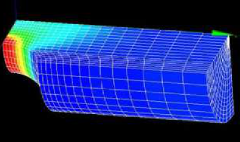
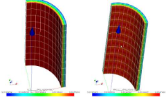

% Performance assessments
% Helfer Thomas; Jean-Michel Proix
% August 20, 2014

# Benchmarks made in the `PLEIADES` platform 

## Fuel performance codes based on the `Cast3M` finite element solver

Numerous performances assessments were made within the PLEIADES
platform : replacing fortran implementations by their `MFront`
counterparts led to significant improvements, from \(30\%\) to
\(50\%\) of the total computational times of some fuel performance
codes developed in the platform.

This improvements were mainly due to fact that the behaviour
integration schemes changed from explicit Runge-Kutta schemes to
implicit ones. The main benefit of `MFront` was to grant users an easier
access to the implicit schemes.

## `Cyrano3` fuel performance code

Relying on the specific modelling hypotheses supported by this code,
namely axisymmetrical generalised plane stress and axisymmetrical
generalised plane strain, highly specialised and efficient
implementations of mechanical behaviours were developed in `Cyrano3`
fuel performance code [see @thouvenin_edf_2010] for both isotropic and
orthotropic materials : numerical integration boils down to solving a
scalar non linear equation in both cases and provides the consistent
tangent operator.

The figure below compares the total computational times of a native
implementation of a cladding behaviour to its equivalent `MFront`
implementation: the last one appears to be competitive with the native
implementation (the average computational time using the `MFront`
implementation is sightly lower than the average computational time
using the native implementation).

# Benchmarks based on the `Code-Aster` finite element solver

---------------------------------------------------------------------------------------------------------------------------------------------------------------------
          Behaviour and test description                                Algorithm                         Total computational times       Graphical illustration
	                                                                                                     (`Code-Aster` vs `MFront`)
-------------------------------------------------------------------  -------------------------         ------------------------------- ------------------------------
Visco-plastic and damaging for steel                                     `Implicit`                       \(17mn 43s\) vs \(7mn 58s\)    
[see @mustata_creep_2005;@edf_comportement_2012]                         			                      
- 3D Notched specimen							                         			                      
implying large deformation						                         			                      
												                         			                      
Damaging for concrete                                                    `Default`                        \(45mn\) vs \(63mn\)           
[see @mazars_new;@edf_modeendommagement_2013],	                         			                      
3D beam bending									                         			                      
												                         			                      
Generic Single crystal viscoplasticity                                   `Implicit`                       \(28mn\) vs \(24mn\)           
[see @meric_single_1991;@edf_comportements_2013-1],                      			                      
3D aggregate, 300 grains						                         			                      
												                         			                      
FCC single crystal viscoplasticity                                       `Ìmplicit`                       \(33m54s\) vs \(29m30s\)       
[see @monnet_orowan_2011@edf_comportements_2013-1]                  ,    			                      
2D specimen with displacement boundary conditions                        			                      
from EBSD experiment                                                                                     
																	     
FCC homogeneized polycrystals 30 grains                                 `Runge-Kutta 4/5`                  \(9s67\) vs \(8s22\)          
[see @berveiller_extension_1978;@edf_comportements_2013-1],
 unit testing

Anisotropic creep with phase transformation,                            `Implicit`                         \(180s\) vs \(171s\)           
3D pipe [see @edf_modecomportement_2013]
-----------------------------------------------------------------------------------------------------------------------------------------------------------------------

Table: Some benchmarks comparing the implementation generated through
`MFront` to the native implementation provided by the `Code-Aster`
finite element solver.  Graphical illustrations shows that the results
obtained with both implementations are indistinguishable.

Developers of the `Code-Aster` general purpose finite element solver,
made independent extensive tests, comparing their own native
implementations to the ones generated with `MFront`, generally using
an implicit scheme in both cases. Without discussing the very details
of each test performed, several general conclusions can be drawn:

- native implementations offers superior performances in the case of
  simple explicit behaviours (Mazars damaging behaviour
  [see @mazars_new]) in the case of isotropic behaviours that can be
  reduce to one scalar equations [see @chaboche_integration_1996]. For
  explicit behaviours, the difference will be reduced by the
  development of an optimised treatment of `MFront` behaviours. In the
  second case, the difference can be explained by the fact that the
  Code-Aster implementations uses the Brent algorithm
  [see @brent_algorithms_1973] which clearly outperforms the standard
  Newton method. The availability of this algorithm in `MFront` is
  planed.
-  for more complex behaviours, `MFront` implementation are on par
  or outperforms the native implementations.

For a given behaviour, the development time was found significantly
lower with `MFront`.

# References
