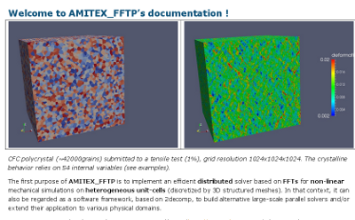

% News
% Helfer Thomas
% November 27, 2014

# Some applications of `MFront` at the [`Cast3M`](http://www-cast3m.cea.fr) user meeting  (4 December 2014)

The [`Cast3M`](http://www-cast3m.cea.fr) user meeting was held in
Paris on November 28, 2014. Jérémy Hure had a talk about the
application of `MFront` in finite strain elasto-plasticity. This talk
is available [here](documents/ClubCast3M2014/HureCast3M14.pdf).

# `AMITEX_FFTP` has its own website (4 December 2014)

[`AMITEX_FFTP`](http://www.maisondelasimulation.fr/projects/amitex/html/)
has now its own
[dedicated webiste](](http://www.maisondelasimulation.fr/projects/amitex/html/)).

The main purpose of
[`AMITEX_FFTP`](http://www.maisondelasimulation.fr/projects/amitex/html/)
is to implement an efficient distributed mechanical solver based on
Fast Fourier
Transform. [`AMITEX_FFTP`](http://www.maisondelasimulation.fr/projects/amitex/html/)
is developped by CEA in the Departement of Nuclear
Material.

[`AMITEX_FFTP`](http://www.maisondelasimulation.fr/projects/amitex/html/)
is distributed under a free license for research and education
purpose.

# Release of TFEL version 2.0.1 (2 December 2014)

`TFEL` version 2.0.1 is now available. This is mainly a bug-fix
release after version 2.0.0.

This version is meant to be used in Code-Aster version 12.3 that will
be released in January 2015.

# Creation of the [tfel-contact@cea.fr](mailto:tfel-contact@cea.fr) address (1 December 2014)

A new contact address has been created:
[tfel-contact@cea.fr](mailto:tfel-contact@cea.fr).

This address can be used to contact directly the developers of `TFEL`
and `MFront` for specific issues. However, if your issue may interest
a broader audience, you may want to send a post to the TFEL users
mailing lists:
[tfel-discuss](mailto:tfel-discuss@lists.sourceforge.net).

# `MFront` talk at Materiaux 2014 Montpellier (24 November 2014)

An `MFront` talk was given at Materiaux 2014. Slides (in french) are
available [here](documents/Materiaux2014/materiaux2014.html).

# Beta release of tfel-2.0.1 for `Windows 64bits` and `Cast3M 2014` (18 November 2014)

A beta version of tfel-2.0.1 for `Windows 64bits` and [`Cast3M`](http://www-cast3m.cea.fr) `2014`
has been released. A binary installer is provided
[here](http://sourceforge.net/projects/tfel/files/Devel/Cast3M-2014/).

Installing this version requires a functional installation of
[`Cast3M`](http://www-cast3m.cea.fr) \(2014\) (which shall be
[patched](downloads/patchs-Cast3M-2014.tar.bz2) to call external
libraries) and the `MSYS` shell (It is recommended not to install
`mingw` compilers along with the `MSYS` shell as [`Cast3M`](http://www-cast3m.cea.fr) provides its
own version of those compilers).

Installation instructions of those requirements are available
[here](install-windows.html).

Any feedback would be gratefully acknowledge.

**Note:** The binary provided requires the `mingw` libraries delivered
with [`Cast3M`](http://www-cast3m.cea.fr) `2014`. 

**Note:** A standalone version of tfel-2.0.1 will be provided shortly. 

# `MFront` behaviours can now be used in `AMITEX_FFTP` (24 October 2014)

`AMITEX_FFTP` is a massively parallel mechanical solver based on FFT
developed at CEA. `MFront` behaviours can be used in `AMITEX_FFTP`
through the `UMAT` interface introduced by the
[`Cast3M`](http://www-cast3m.cea.fr) finite element solver.

 voxels)")

# `TFEL/MFront` on [`Cast3M`](http://www-cast3m.cea.fr) web site (15 October 2014)

[A page dedicated](http://www-cast3m.cea.fr/index.php?xml=mfront) to
`MFront` is now available on the [`Cast3M`](http://www-cast3m.cea.fr)
web site.

# Release of TFEL 2.0 (1 October 2014)

Here is the official announcement by Jean-Paul DEFFAIN (in French):

  > Bonjour,
  > 
  > Une version libre de MFront est désormais officiellement disponible
  > sous licence GPL et CECILL-A.
  > 
  > Cette version 2.0 permet entre autres de générer des lois de
  > comportements en transformations infinitésimales et en grandes
  > transformations ainsi que des modèles de zones cohésives. Les lois
  > générées sont utilisables dans les codes aux éléments finis Cast3M,
  > Code-Aster, ZeBuLoN, l’ensemble des applications développées dans la
  > plateforme PLEIADES, notamment Cyrano3, et le solveur FFT de la
  > plate-forme. Des interfaces vers d'autres codes peuvent être
  > rajoutées.
  > 
  > Un projet dédié a été crée sur sourceforge
  > (<http://sourceforge.net/projects/tfel>) et fournit :
  > 
  > - un site dédié (<http://tfel.sourceforge.net>)
  > - un espace de téléchargement
  >   (<http://sourceforge.net/projects/tfel/files>) qui permet d'accéder
  >   à la version 2.0
  > - les listes de diffusion tfel-announce et tfel-discuss
  >   (<http://sourceforge.net/p/tfel/tfel>)
  > - un forum (<http://sourceforge.net/p/tfel/discussion>)
  > - un outil de demande d'évolution et de déclaration de bugs par
  >   tickets (<http://sourceforge.net/p/tfel/tickets>)
  > 
  > Pour les personnes souhaitant contribuer au développement, le dépôt
  > subversion est accessible sur le serveur:
  > 
  > <https://svn-pleiades.cea.fr/SVN/TFEL>
  > 
  > L’accès à ce dépôt est ouvert à tous mais nécessite l’ouverture d’un
  > compte spécifique sur demande au
  > [chef du projet PLEIADES](mailto:vincent.marelle@cea.fr).
  > 
  > Nous remercions chaleureusement tous ceux qui ont contribué à cette
  > version et invitons toutes les personnes intéressées à se joindre au
  > développement de MFront.
  > 
  > Jean-Paul DEFFAIN
  > 
  > Chef du programme SIMU
  > 
  > Commissariat à l'Énergie Atomique
