% News
% Helfer Thomas
% January 23, 2017

\newcommand{\absvalue}[1]{{\left|#1\right|}}
\newcommand{\paren}[1]{{\left(#1\right)}}
\newcommand{\tenseur}[1]{\underline{#1}}
\newcommand{\tenseurq}[1]{\underline{\underline{\mathbf{#1}}}}
\newcommand{\tepsilonto}{\tenseur{\varepsilon}^{\mathrm{to}}}
\newcommand{\tepsilonel}{\tenseur{\varepsilon}^{\mathrm{el}}}
\newcommand{\tepsilonvis}{\tenseur{\varepsilon}^{\mathrm{vis}}}
\newcommand{\tdepsilonvis}{\tenseur{\dot{\varepsilon}}^{\mathrm{vis}}}
\newcommand{\tepsilonp}{\tenseur{\varepsilon}^{\mathrm{p}}}
\newcommand{\tsigma}{\underline{\sigma}}
\newcommand{\trace}[1]{{\mathrm{tr}\paren{#1}}}
\newcommand{\sigmaH}{\sigma_{H}}
\newcommand{\Frac}[2]{{{\displaystyle \frac{\displaystyle #1}{\displaystyle #2}}}}
\newcommand{\deriv}[2]{{\displaystyle \frac{\displaystyle \partial #1}{\displaystyle \partial #2}}}
\newcommand{\sigmaeq}{\sigma_{\mathrm{eq}}}

# A seminar about `TFEL/MFront` at the ENSMM (7/06/2018)

On the 7th of May, we had the chance to make a seminar about
`TFEL/MFront` at the [ENSMM (École nationale supérieure de mécanique et
des microtechniques) Besançon](https://www.ens2m.fr/) on 7/06/2018 in
the Departement of Applied Mechanics.

The talk is available here:
<https://github.com/thelfer/tfel-doc/tree/master/Talks/ENSMM2018>.

# Release of version 3.1.2 of `TFEL/MFront` (31/05/2018)

In prevision of the forthcoming release of the `Alcyone` fuel
performance code, `TFEL` 3.1.2 has been released. This is mostly a bug
fix. Thanks to all the users who reported the issues and contributed to
the enhancement of `TFEL/MFront`.

A special focus is made on [Ticket #127](http://tfel.sourceforge.net/release-notes-3.1.2.html#ticket-127-substepping-in-the-cast3m-and-cyrano-interface-may-lead-to-a-invalid-convergence-du-to-integer-overflow) that may change the results of badly convergent behaviours using sub-stepping with the `Cast3M` and `Cyrano` interfaces.

A detailed version of the release notes is available
[here](http://tfel.sourceforge.net/release-notes-3.1.2.html).

# Castem 2018 is out (25/05/2018)

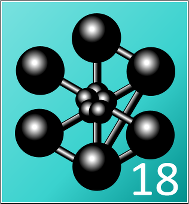

[`Cast3M`](http://www-cast3m.cea.fr) 2018 has been released.

Binary package for `Cast3M 2018` and `Windows 64` are now available for
download:
<https://sourceforge.net/projects/tfel/files>.

See also the example:
<http://tfel.sourceforge.net/downloads/windows-install-scripts.tar.bz2>.
The test directory contains an example showing how to use this binary
package. Be sure to change the `PATH` variable to match your
installation directories at the beginning of the `mfront-Cast3M2018.bat`
and `launch-Cast3M2018.bat` files.

# New entry in the gallery: perfect plasticity based on the Drucker-Prager yield criterion and a cap (27/05/2018)

The yield surface is combining two surfaces:

- The first surface is based on the Drucker-Prager yield criterion defined as follows:
  \[
  \sigmaeq^{\mathrm{DP}}=q+\tan\paren{\beta}\,p
  \]
  where:
    - \(p\) is the hydrostatique pressure:
      \[
      p = \Frac{1}{3}\,\trace{\tsigma}
      \]
    - \(q\) is the von Mises norm of the stress tensor \(\tsigma\):
      \[
      q = \sigmaeq = \sqrt{3\,J_{2}} = \sqrt{\Frac{3}{2}\,\tenseur{s}\,\colon\,\tenseur{s}}
      \]
      where \(\tenseur{s}\) is the deviatoric part of the stress tensor and \(J_{2}\)
      the second invariant of \(\tenseur{s}\).
  The plastic surface is defined using a constant yield stress
  \(R_{0}^{\mathrm{DP}}\):
  \[
  \sigmaeq^{\mathrm{DP}}-R_{0}^{\mathrm{DP}}=0
  \]
  This surface is a line in the \(\paren{p,q}\) plane.
- The second surface forms a so-called cap which closes the first
  plastic surface. This plastic surface is based on a criterion close the Green one
  (See @fritzen_computational_2013 and [this page](greenplasticity.html)
  for details):
  \[
  \sigmaeq^{c}=\sqrt{\paren{p-p_{a}}^{2}+\paren{R\,q}^{2}}
  \]
  Again, the plastic surface is defined using a constant yield stress
  \(R_{0}^{c}\), as follows:
  \[
  \sigmaeq^{c}-R_{0}^{c}=0
  \]  
  This surface is an ellipse in the \(\paren{p,q}\)
  plane.

{width=80%}

# Simulation of deep drawing for a very anisotropic material (23/05/2018)

  <video style="display:block; margin: 0 auto;" width="640" height="320" controls>
    <source src="media/DeepDrawing.mp4" type="video/mp4">
    Your browser does not support the video tag.
  </video>

 
This video reproduces the work of Yoon et al (See
@yoon_prediction_2006). in Abaqus/Standard and Abaqus/Explicit. The
material is described by Barlat' Yld2004-18p yield function (See
@barlat_linear_2005), as described [here](barlat-yld2004.html).

# A newly published paper “Void Growth and Coalescence in Irradiated Copper Under Deformation.” (21/04/2018)

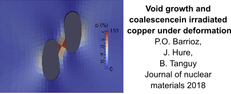{width=100%}

A new paper using `MFront` has been published in the Journal of Nuclear
Materials (@barrioz_void_2018). See
<https://doi.org/10.1016/j.jnucmat.2018.01.064> for the online version.

# A new constitutive law to model the load induced thermal strain (LITS) of concrete materials (11/04/2018)

"){width=100%}

Giacomo Torelli (The University of Cambridge), Parthasarathi Mandal (The
University of Manchester) and Martin Gillie (The University of Warwick)
developed a new constitutive laws describing the Load-Induced-Thermal-Strain
(LITS) which captures the experimentally demonstrated behaviour of
concrete in the case of heating under multiaxial mechanical load, for
temperatures up to \(500\mbox^{\circ{}}C\).

In contrast to the models available in the literature, this new
behaviour takes into account the observed dependency of LITS on stress
confinement. Such a dependency is introduced through a confinement
coefficient which makes LITS directly proportional to the confinement of
the stress state.

Details of theoretical and numerical implementation can be found in
@torelli_confinement-dependent_2018.

The implementation of the behaviour is available in the `MFrontGallery`
[here](https://github.com/thelfer/MFrontGallery/blob/master/generic-behaviours/viscoplasticity/LoadInducedThermalStrain_Torelli2018.mfront).

# Release of version 3.1.1 of `TFEL/MFront` (7/03/2017)

In prevision of the 14.2 release of `Code_Aster` and 2018 release of
`Salome-Meca`, `TFEL` 3.1.1 has been released. This is mostly a bug fix
version with a few enhancements.

A detailed version of the release notes is available
[here](http://tfel.sourceforge.net/release-notes-3.1.1.html).

# Orthotropic generalization of the invariants of the stress deviator tensor (16/11/2018)

Within the framework of the theory of representation, generalizations
to orthotropic conditions of the invariants of the deviatoric stress
have been proposed by Cazacu and Barlat (see
@cazacu_generalization_2001):

- The generalization of \(J_{2}\) is denoted \(J_{2}^{O}\). It is
  defined by:
  \[
  J_{2}^{O}= a_6\,s_{yz}^2+a_5\,s_{xz}^2+a_4\,s_{xy}^2+\frac{a_2}{6}\,(s_{yy}-s_{zz})^2+\frac{a_3}{6}\,(s_{xx}-s_{zz})^2+\frac{a_1}{6}\,(s_{xx}-s_{yy})^2
  \]
  where the \(\left.a_{i}\right|_{i\in[1:6]}\) are six coefficients
  describing the orthotropy of the material.
- The generalization of \(J_{3}\) is denoted \(J_{3}^{O}\). It is
  defined by:
  \[
  \begin{aligned}
  J_{3}^{O}=
  &\frac{1}{27}\,(b_1+b_2)\,s_{xx}^3+\frac{1}{27}\,(b_3+b_4)\,s_{yy}^3+\frac{1}{27}\,(2\,(b_1+b_4)-b_2-b_3)\,s_{zz}^3\\
  &-\frac{1}{9}\,(b_1\,s_{yy}+b_2s_{zz})\,s_{xx}^2\\
  &-\frac{1}{9}\,(b_3\,s_{zz}+b_4\,s_{xx})\,s_{yy}^2\\
  &-\frac{1}{9}\,((b_1-b_2+b_4)\,s_{xx}+(b_1-b3+b_4)\,s_{yy})\,s_{zz}^3\\
  &+\frac{2}{9}\,(b_1+b_4)\,s_{xx}\,s_{yy}\,s_{zz}\\
  &-\frac{s_{xz}^2}{3}\,(2\,b_9\,s_{yy}-b_8\,s_{zz}-(2\,b_9-b_8)\,s_{xx})\\
  &-\frac{s_{xy}^2}{3}\,(2\,b_{10}\,s_{zz}-b_5\,s_{yy}-(2\,b_{10}-b_5)\,s_{xx})\\
  &-\frac{s_{yz}^2}{3}\,((b_6+b_7)\,s_{xx}-b_6\,s_{yy}-b_7\,s_{zz})\\
  &+2\,b_{11}\,s_{xy}\,s_{xz}\,s_{yz}
  \end{aligned}
  \]
  where the \(\left.b_{i}\right|_{i\in[1:11]}\) are eleven coefficients
  describing the orthotropy of the material.

Those invariants may be used to generalize isotropic yield criteria
based on \(J_{2}\) and \(J_{3}\) invariants to orthotropy.

The following functions 

\(J_{2}^{0}\), \(J_{3}^{0}\) and their first and second derivatives
with respect to the stress tensor \(\tsigma\) can be computed
by the following functions:

- `computesJ2O`, `computesJ2ODerivative` and
  `computesJ2OSecondDerivative`.
- `computesJ3O`, `computesJ3ODerivative` and
  `computesJ3OSecondDerivative`.

Those functions take the stress tensor as first argument and each
orthotropic coefficients. Each of those functions has an overload
taking the stress tensor as its firs arguments and a tiny vector
(`tfel::math::tvector`) containing the orthotropic coefficients.

# Efficient computations of the first and second derivatives of the invariants of the stress deviator tensor with respect to the stress (10/01/2018)

Let \(\tsigma\) be a stress tensor. Its deviatoric part
\(\tenseur{s}\) is:

\[
\tenseur{s}=\tsigma-\Frac{1}{3}\,\trace{\tsigma}\,\tenseur{I}
=\paren{\tenseurq{I}-\Frac{1}{3}\,\tenseur{I}\,\otimes\,\tenseur{I}}\,\colon\,\tsigma
\]

The deviator of a tensor can be computed using the `deviator`
function.

As it is a second order tensor, the stress deviator tensor also has a
set of invariants, which can be obtained using the same procedure used
to calculate the invariants of the stress tensor. It can be shown that
the principal directions of the stress deviator tensor \(s_{ij}\) are
the same as the principal directions of the stress tensor
\(\sigma_{ij}\). Thus, the characteristic equation is

\[
\left| s_{ij}- \lambda\delta_{ij} \right| = -\lambda^3+J_1\lambda^2-J_2\lambda+J_3=0,
\]

where \(J_1\), \(J_2\) and \(J_3\) are the first, second, and third
*deviatoric stress invariants*, respectively. Their values are the same
(invariant) regardless of the orientation of the coordinate system
chosen. These deviatoric stress invariants can be expressed as a
function of the components of \(s_{ij}\) or its principal values \(s_1\),
\(s_2\), and \(s_3\), or alternatively, as a function of \(\sigma_{ij}\) or
its principal values \(\sigma_1\), \(\sigma_2\), and \(\sigma_3\). Thus,

\[
\begin{aligned}
J_1 &= s_{kk}=0,\, \\
J_2 &= \textstyle{\frac{1}{2}}s_{ij}s_{ji} = \Frac{1}{2}\trace{\tenseur{s}^2}\\
&= \Frac{1}{2}(s_1^2 + s_2^2 + s_3^2) \\
&= \Frac{1}{6}\left[(\sigma_{11} - \sigma_{22})^2 + (\sigma_{22} - \sigma_{33})^2 + (\sigma_{33} - \sigma_{11})^2 \right ] + \sigma_{12}^2 + \sigma_{23}^2 + \sigma_{31}^2 \\
&= \Frac{1}{6}\left[(\sigma_1 - \sigma_2)^2 + (\sigma_2 - \sigma_3)^2 + (\sigma_3 - \sigma_1)^2 \right ] \\
&= \Frac{1}{3}I_1^2-I_2 = \frac{1}{2}\left[\trace{\tenseur{\sigma}^2} - \frac{1}{3}\trace{\tenseur{\sigma}}^2\right],\,\\
J_3 &= \det(s_{ij}) \\
&= \Frac{1}{3}s_{ij}s_{jk}s_{ki} = \Frac{1}{3} \trace{\tenseur{s}^3}\\
&= \Frac{1}{3}(s_1^3 + s_2^3 + s_3^3) \\
&= s_1s_2s_3 \\
&= \Frac{2}{27}I_1^3 - \Frac{1}{3}I_1 I_2 + I_3 = \Frac{1}{3}\left[\trace{\tenseur{\sigma}^3} - \trace{\tenseur{\sigma}^2}\trace{\tenseur{\sigma}} +\Frac{2}{9}\trace{\tenseur{\sigma}}^3\right].
\end{aligned}
\]

where \(I_{1}\), \(I_{2}\) and \(I_{3}\) are the invariants of
\(\tsigma\).

\(J_{2}\) and \(J_{3}\) are building blocks for many isotropic yield
critera. Classically, \(J_{2}\) is directly related to the von Mises
stress \(\sigmaeq\):

\[
\sigmaeq=\sqrt{\Frac{3}{2}\,\tenseur{s}\,\colon\,\tenseur{s}}=\sqrt{3\,J_{2}}
\]

The first and second derivatives of \(J_{2}\) with respect to
\(\sigma\) can be trivially implemented, as follows:

~~~~{.cpp}
constexpr const auto id  = stensor<N,real>::Id();
constexpr const auto id4 = st2tost2<N,real>::Id();
// first derivative of J2
const auto dJ2  = deviator(sig);
// second derivative of J2
const auto d2J2 = eval(id4-(id^id)/3);
~~~~

In comparison, the computation of the first and second derivatives of
\(J_{3}\) with respect to \(\sigma\) are more cumbersome. In previous
versions `TFEL`, one had to write:

~~~~{.cpp}
constexpr const auto id = stensor<N,real>::Id();
constexpr const auto id4 = st2tost2<N,real>::Id();
const auto I1   = trace(sig);
const auto I2   = (I1*I1-trace(square(sig)))/2;
const auto dI2  = I1*id-sig;
const auto dI3  = computeDeterminantDerivative(sig);
const auto d2I2 = (id^id)-id4;
const auto d2I3 = computeDeterminantSecondDerivative(sig);
// first derivative of J3
const auto dJ3  = eval((2*I1*I1/9)*id-(I2*id+I1*dI2)/3+dI3);
// second derivative of J3
const auto d2J3 = eval((4*I1/9)*(id^id)-((id^dI2)+(dI2^id)+i1*d2I2)/3+d2I3);
~~~~

More efficient implementations are now available using the
`computeDeviatorDeterminantDerivative` and
`computeDeviatorDeterminantSecondDerivative` functions:

~~~~{.cpp}
// first derivative of J3
const auto dJ3  = computeDeviatorDeterminantDerivative(sig);
// second derivative of J3
const auto d2J3 = computeDeviatorDeterminantSecondDerivative(sig);
~~~~

# The `doxygen` documentation (4/01/2018)

Further documentation for advanced users has been published: the
internal code documentation of the project, as generated by
[`doxygen`](http://doxygen.org), is now available online:

<http://tfel.sourceforge.net/doxygen/index.html>

The theme has been adapted from:

<https://github.com/Velron/doxygen-bootstrapped>

# Release of versions 3.1 and 3.0.3 of `TFEL/MFront` (15/12/2017)

Versions 3.1 and 3.0.3 of `TFEL`, `MFront` and `MTest` has been
released on the 15th December, 2017.

## Version 3.1

A detailed version of the release notes is available
[here](http://tfel.sourceforge.net/release-notes-3.1.html).

### Highlights

From a user point of view, TFEL 3.1 brings many important features:

- The gallery is a list of detailed documentations about implementing
  clean, efficient and reliable mechanical behaviour using `MFront`
  that will be updated as TFEL and MFront evolve. In each case, the
  integration algorithm is fully described. The gallery currently
  contains \(17\) entries covering finite strain elasticity, finite
  strain viscoplasticity, damage, plasticity and viscoplasticity. The
  gallery. Those implementations are also gathered in a `cmake`
  projects called `MFrontGallery` which can be cloned on github:
  <https://github.com/thelfer/MFrontGallery>
- The integration of the `TFEL/NUMODIS` library which provides many
  functionalities associated with single crystal description coming
  from the [`NUMODIS` project](http://www.numodis.fr/). Those
  functionalities are available in `MFront` through many new keywords
  that simplify to a great extent the way small and finite strain
  single crystal behaviours can be written. See the following page for
  a detailled description:
  <http://tfel.sourceforge.net/singlecrystal.html>
- The `DDIF2` behaviour is used in CEA fuel performances codes to
  describe cracking of the nuclear fuel. The `DDIF2` brick allows this
  model to be easily coupled to the viscplastic behaviour of the fuel
  material and can be used as easily as the `StandardElasticity`
  brick. See this page for details:
  <http://tfel.sourceforge.net/ddif2.html>
- An important work has been devoted to enhance the overall numerical
  reproducibility and stability of the algorithms of `TFEL/Math`. It
  is now much safer to use the `-ffast-math` option in `gcc` and
  `clang` which can drastically increase the efficiency of the
  generated code. This option is automatically added when using the
  `--obuild=level2` option of `mfront`. See the release notes for
  details.
- Support for the Hershey/Hosford yield criteria which generalizes the
  Mises criteria. Indeed the Hershey/Hosford yield criteria lies
  between the Mises criteria and the Tresca criteria. Various
  functions have been introduced to compute the equivalent stress
  associated with this criteria, its first and second derivatives. See
  this page for details: <http://tfel.sourceforge.net/tensors.html>
- Support for the Barlat yield criteria which generalizes the Hill
  criteria. Various functions have been introduced to compute the
  equivalent stress associated with this criteria, its first and
  second derivatives. See this page for details:
  <http://tfel.sourceforge.net/tensors.html>
- Abritrary non linear constraints can now be defined in `MTest`.
- Better support of the Windows platform. Using the `cmake` generator,
  using `mfront` on windows with the `Microsoft` compilers is easy and
  closely follows the existing practices on other operating systems.
- Improved installation options. Two versions, or the same version in
  different flavours (compiled in debug mode, compiled with different
  compilers), of `TFEL/MFront` can now be installed in parallel.
  See <http://tfel.sourceforge.net/install.html> for details.

### Mechanical behaviours

#### New interfaces

Two new interfaces have been introduced in `MFront`:

- A native interface for the `CalculiX` solver. Here native is used to
  distinguish this interface from the `Abaqus/Standard` interface
  which can also be used within `CalculiX`. This interface can be used
  with `CalculiX` 2.13.
- An interface for the `ANSYS` `APDL` solver. The latter is still
  experimental.

#### The `@NumericallyComputedJacobianBlocks` keyword

Computing the jacobian of the implicit system is the most difficult
part of implementing a behaviour. Computing the jacobian by finite
difference is interesting but significantly decreases the performances
of the behaviour and can be (very) sensitive to the choice of the
numerical perturbation.

The `@NumericallyComputedJacobianBlocks` keyword is used select a list
of jacobian blocks that have to be computed numerically. This is more
efficient than computing the whole jacobian numerically. Combined with
the ability to compare the jacobian to a numerical approximation, the
user now has the ability to build the jacobian incrementally, block by
block and checks at each steps that their analytical expressions are
correct.

### Portability

  <ul class="slides">
	<li></li>
	<li></li>
	<li></li>
	<li></li>
	<li></li>
	<li></li>
	<li></li>
	<li></li>
	<li></li>
  </ul>
  
  

Portability is a convincing sign of software quality and
maintainability:

- usage of functionalities specific to operating
  systems are well identified.
- it demonstrates that the code is not dependant of the system
  libraries, such as the `C` or `C++` libraries.

`TFEL` has been tested successfully on a various flavours of `LinuX`
and `BSD` systems (including `FreeBSD` and `OpenBSD`). The first ones
are mostly build on `gcc`, `libstdc++` and the `glibc`. The second
ones are build on `clang` and `libc++`.

`TFEL` can be build on `Windows` in a wide variety of configurations
and compilers:

- native ports can be build using the `Visual Studio` (2015 and 2017)
  or `MingGW` compilers.
- `TFEL` can be build in the `Cygwin` environment.

`TFEL` have reported to build successfully in the `Windows Subsystem
for LinuX` (`WSL`) environment.

Although not officially supported, more exotic systems, such as
`OpenSolaris` and `Haiku`, have also been tested successfully. The
`Minix` operating systems provides a pre-release of `clang` `3.4` that
fails to compile `TFEL`.

#### Supported compilers

Version 3.1 has been tested using the following compilers:

- [`gcc`](https://gcc.gnu.org/) on various `POSIX` systems: versions
  4.7, 4.8, 4.9, 5.1, 5.2, 6.1, 6.2, 7.1, 7.2
- [`clang`](http://clang.llvm.org/) on various `POSIX` systems:
  versions 3.5, 3.6, 3.7, 3.8, 3.9, 4.0, 5.0
- [`intel`](https://software.intel.com/en-us/intel-compilers). The
  only tested version is the 2018 version on `LinuX`.
  [Intel compilers 15 and 16](https://software.intel.com/en-us/intel-compilers)
  are known not to work due to a bug in the [EDG](https://www.edg.com)
  front-end that can't parse a syntax mandatory for the expression
  template engine. The same bug affects the
  [Blitz++](http://sourceforge.net/projects/blitz/) library (see
  <http://dsec.pku.edu.cn/~mendl/blitz/manual/blitz11.html>). Version
  2017 shall work but were not tested.
- [`Visual Studio`](https://www.visualstudio.com/) The only supported
  versions are the 2015 and 2017 versions. Previous versions do not
  provide a suitable `C++11` support.
- `PGI` compiler (NVIDIA): version 17.10 on `LinuX`
- `MinGW` has been tested successfully in a wide variety of
  configurations/versions, including the version delivered with
  `Cast3M 2017`.

#### Benchmarcks

|  Compiler and options    |  Success ratio    |  Test time  |
|:------------------------:|:-----------------:|:-----------:|
|  `gcc 4.9.2`             | 100% tests passed |  681.19 sec |
|  `gcc 4.9.2+fast-math`   | 100% tests passed |  572.48 sec |
|  `clang 3.5`             | 100% tests passed |  662.50 sec |
|  `clang 3.5+libstcxx`    |  99% tests passed |  572.18 sec |
|  `clang 5.0`             | 100% tests passed |  662.50 sec |
|  `icpc 2018`             | 100% tests passed |  511.08 sec |
|  `PGI 17.10`             |  99% tests passed |  662.61 sec |
: A comparison of various compilers and specific options

Concerning the `PGI` compilers, performances may be affected by the
fact that this compiler generates huge shared libraries (three to ten
times larger than other compilers).

## Version 3.0.3

This is mainly a bug fix version of the `3.0` series. Detailed release
notes are available [here](release-notes-3.0.3.html). There are no
known regressions.

# New entry in the gallery: perfect plasticity based on the Green yield criterion (30/11/2017)

 and the von Mises criterion in plane stress"){width=70%}

The Green yield criterion is based on the definition of an equivalent stress
\(\sigmaeq\) defined as follows:
\[
\sigmaeq=\sqrt{\Frac{3}{2}\,C\,\tenseur{s}\,\colon\,\tenseur{s}+F\,\trace{\tsigma}^{2}}
\]
where \(\tenseur{s}\) is the deviatoric stress tensor:
\[
\tenseur{s}=\tsigma-\Frac{1}{3}\,\trace{\tsigma}\,\tenseur{I}
\]

[A new entry](greenplasticity.html) in the gallery shows how to build
a perfect plastic behaviour based on this equivalent stress. The
implementation is available here:
<https://github.com/thelfer/MFrontGallery/blob/master/generic-behaviours/plasticity/GreenPerfectPlasticity.mfront>

# Barlat stress (24/11/2017)

Functions to compute the Barlat equivalent stress and its first and
second derivatives are now available in `TFEL/Material`.

The Barlat equivalent stress is defined as follows (See @barlat_linear_2005):
\[
\sigmaeq^{B}=
\sqrt[a]{
  \frac{1}{4}\left(
  \sum_{i=0}^{3}
  \sum_{j=0}^{3}
  \absvalue{s'_{i}-s''_{j}}^{a}
  \right)
}
\]

where \(s'_{i}\) and \(s''_{i}\) are the eigenvalues of two
transformed stresses \(\tenseur{s}'\) and \(\tenseur{s}''\) by two
linear transformation \(\tenseurq{L}'\) and \(\tenseurq{L}''\):
\[
\left\{
\begin{aligned}
\tenseur{s}'  &= \tenseurq{L'} \,\colon\,\tsigma \\
\tenseur{s}'' &= \tenseurq{L''}\,\colon\,\tsigma \\
\end{aligned}
\right.
\]

The linear transformations \(\tenseurq{L}'\) and \(\tenseurq{L}''\)
are defined by \(9\) coefficients (each) which describe the material
orthotropy. There are defined through auxiliary linear transformations
\(\tenseurq{C}'\) and \(\tenseurq{C}''\) as follows:
\[
\begin{aligned}
\tenseurq{L}' &=\tenseurq{C}'\,\colon\,\tenseurq{M} \\
\tenseurq{L}''&=\tenseurq{C}''\,\colon\,\tenseurq{M}
\end{aligned}
\]
where \(\tenseurq{M}\) is the transformation of the stress to its deviator:
\[
\tenseurq{M}=\tenseurq{I}-\Frac{1}{3}\tenseur{I}\,\otimes\,\tenseur{I}
\]

The linear transformations \(\tenseurq{C}'\) and \(\tenseurq{C}''\) of
the deviator stress are defined as follows:
\[
\tenseurq{C}'=
\begin{pmatrix}
0 & -c'_{12} & -c'_{13} & 0 & 0 & 0 \\
-c'_{21} & 0 & -c'_{23} & 0 & 0 & 0 \\
-c'_{31} & -c'_{32} & 0 & 0 & 0 & 0 \\
0 & 0 & 0 & c'_{44} & 0 & 0 \\
0 & 0 & 0 & 0 & c'_{55} & 0 \\
0 & 0 & 0 & 0 & 0 & c'_{66} \\
\end{pmatrix}
\quad
\text{and}
\quad
\tenseurq{C}''=
\begin{pmatrix}
0 & -c''_{12} & -c''_{13} & 0 & 0 & 0 \\
-c''_{21} & 0 & -c''_{23} & 0 & 0 & 0 \\
-c''_{31} & -c''_{32} & 0 & 0 & 0 & 0 \\
0 & 0 & 0 & c''_{44} & 0 & 0 \\
0 & 0 & 0 & 0 & c''_{55} & 0 \\
0 & 0 & 0 & 0 & 0 & c''_{66} \\
\end{pmatrix}
\]

When all the coefficients \(c'_{ji}\) and \(c''_{ji}\) are equal to
\(1\), the Barlat equivalent stress reduces to the Hosford equivalent
stress.

The following function has been implemented:

- `computeBarlatStress`: return the Barlat equivalent stress
- `computeBarlatStressNormal`: return a tuple containg the Barlat
  equivalent stress and its first derivative (the normal)
- `computeBarlatStressSecondDerivative`: return a tuple containg the
  Barlat equivalent stress, its first derivative (the normal) and the
  second derivative.

The implementation of those functions are greatly inspired by the work
of Scherzinger (see @scherzinger_return_2017). In particular, great
care is given to avoid overflows in the computations of the Barlat
stress.

Those functions have two template parameters:

- the type of symmetric tensors used for the stress tensor
  (automatically deduced, but required if the second parameter is
  specified).
- the eigen solver to be used.

## Example

The following example computes the Barlat   equivalent stress, its
normal and second derivative:

~~~~{.cpp}
const auto l1 = makeBarlatLinearTransformation<N,double>(-0.069888,0.936408,
                                                         0.079143,1.003060,
                                                         0.524741,1.363180,
                                                         1.023770,1.069060,
                                                         0.954322);
const auto l2 = makeBarlatLinearTransformation<N,double>(-0.981171,0.476741,
    							                         0.575316,0.866827,
    							                         1.145010,-0.079294,
    							                         1.051660,1.147100,
    							                         1.404620);
stress seq;
Stensor  n;
Stensor4 dn;
std::tie(seq,n,dn) = computeBarlatStressSecondDerivative(s,l1,l2,a,seps);
~~~~

In this example, `s` is the stress tensor, `a` is the Hosford
exponent, `seps` is a numerical parameter used to detect when two
eigenvalues are equal.

If `C++-17` is available, the previous code can be made much more readable:

~~~~{.cpp}
const auto l1 = makeBarlatLinearTransformation<N,double>(-0.069888,0.936408,
                                                         0.079143,1.003060,
                                                         0.524741,1.363180,
                                                         1.023770,1.069060,
                                                         0.954322);
const auto l2 = makeBarlatLinearTransformation<N,double>(-0.981171,0.476741,
    							                         0.575316,0.866827,
    							                         1.145010,-0.079294,
    							                         1.051660,1.147100,
    							                         1.404620);
const auto [seq,n,dn] = computeBarlatStressSecondDerivative(s,l1,l2,a,seps);
~~~~

# Hosford equivalent stress (17/10/2017)

 and the von Mises stress in plane stress"){width=70%}

The header `TFEL/Material/Hosford1972YieldCriterion.hxx` introduces
three functions which are meant to compute the Hosford equivalent
stress and its first and second derivatives. *This header is
automatically included by `MFront`*

The Hosford equivalent stress is defined by:
\[
\sigmaeq=\sqrt{\Frac{1}{2}\paren{\absvalue{\sigma_{1}-\sigma_{2}}^{2}+\absvalue{\sigma_{1}-\sigma_{3}}^{2}+\absvalue{\sigma_{2}-\sigma_{3}}^{2}}}
\]
where \(s_{1}\), \(s_{2}\) and \(s_{3}\) are the eigenvalues of the
stress.

Therefore, when \(a\) goes to infinity, the Hosford stress reduces to
the Tresca stress. When \(n = 2\) the Hosford stress reduces to the
von Mises stress.

The following function has been implemented:

- `computeHosfordStress`: return the Hosford equivalent stress
- `computeHosfordStressNormal`: return a tuple containg the Hosford
  equivalent stress and its first derivative (the normal)
- `computeHosfordStressSecondDerivative`: return a tuple containg the
  Hosford equivalent stress, its first derivative (the normal) and the
  second derivative.

## Example

The following example computes the Hosford equivalent stress, its
normal and second derivative:

~~~~{.cpp}
stress seq;
Stensor  n;
Stensor4 dn;
std::tie(seq,n,dn) = computeHosfordStressSecondDerivative(s,a,seps);
~~~~

In this example, `s` is the stress tensor, `a` is the Hosford
exponent, `seps` is a numerical parameter used to detect when two
eigenvalues are equal.

If `C++-17` is available, the previous code can be made much more readable:

~~~~{.cpp}
const auto [seq,n,dn] = computeHosfordStressSecondDerivative(s,a,seps);
~~~~

# Release of `TFEL` `3.0.2` (25/10/2017)

Version 3.0.2 of `TFEL`, `MFront` and `MTest` has been released on the
25th October, 2017.

This is mainly a bug fix version of the `3.0` series. Detailed release
notes are available [here](release-notes-3.0.2.html). There are no
known regressions.

# Behaviours for modelling mild steel (14/09/2017)

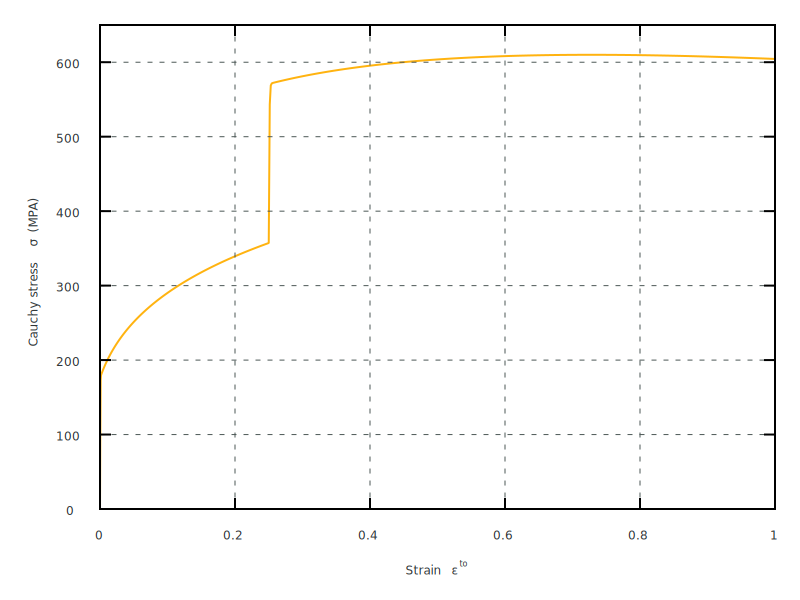{width=75%}

Thanks to Guillaume Michal, University of Wollongong (NSW, Australia),
several implementation of behaviours suitable for the description of
mild steel are now available:

- Three versions of the Johnson-Cook behaviour:
   - `JohnsonCook_s`: which describes strain hardening but does not describe rate effects,
   - `JohnsonCook_ssr` : which describes both strain hardening and rate effects.
   - `JohnsonCook_ssrt`: which describes both strain hardening, rate effects and adiabatic heating.
-  The Rusinek-Klepaczko law as described in: "Constitutive relations
  in 3-D for a wide range of strain rates and temperatures -
  Application to mild steels". A. Rusinek, R. Zaera and
  J. R. Klepaczko.  Int. J. of Solids and Structures, Vol. 44,
  5611-5634, 2007.

# Support for the total lagragian framework in `Code_Aster`

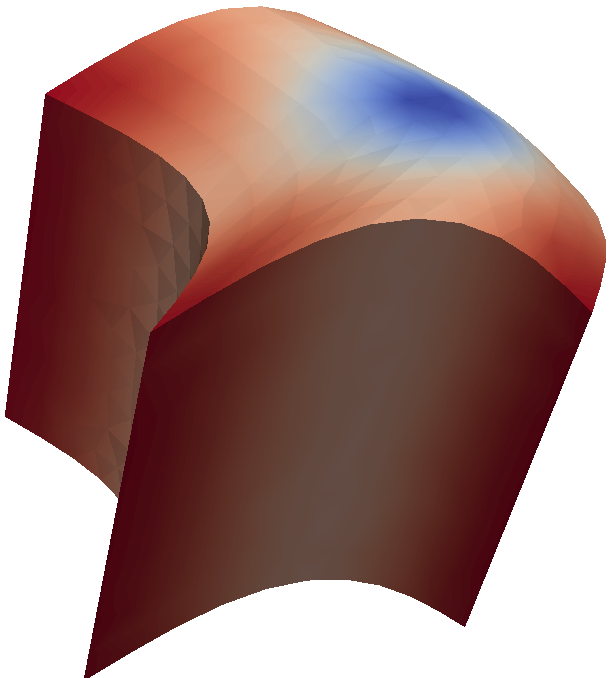{width=50%}

Thanks to M. Abbas, `MFront` finite strain behaviours can now be used
in the total lagragian framework in `Code_Aster` (called
`GROT_GDEP`). First tests confirm that the robustness and the effiency
of this framework are much better than with the `SIMO_MIEHE` framework.

# First tests of `MFront` in the `Windows` `Subsystem` for `LinuX` environment (3/08/2017)

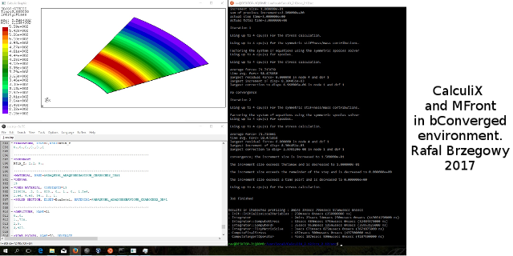

After [`Visual Studio`](https://www.visualstudio.com),
[`Mingw`](http://www.mingw.org/) and
[`Cygwin`](https://www.cygwin.com/), there is a new way to get
`MFront` working on `Windows` !

Rafal Brzegowy have successfully compiled and tested `MFront` using
the
[`Windows` `Subsystem` for `LinuX`](https://blogs.msdn.microsoft.com/wsl/)
(WSL). He was able to use `MFront` generated behaviours with
[`CalculiX`](http://www.calculix.de) delivered by the
[`bConverged`](http://www.bconverged.com/products.php) suite.

All tests worked, except some tests related to the `long double`
support in WSL.

# Official twitter account (1/08/2017)

`TFEL` and `MFront` now have their official twitter account !

We will use it to spread various events and developments make in
`TFEL` and `MFront`.

# A spanish introduction to `MFront` and `Salome-Meca` (1/08/2017)

Thanks to Jordi Alberich, a spanish introduction to `MFront` and
`Salome-Meca` is available here:

<http://tfel.sourceforge.net/tutorial-spanish.html>

# The talks of the third MFront Users Day (21 June 2017)

The talks of the third MFront Users Day are available here:

<https://github.com/thelfer/tfel-doc>

# Cast3m 2017 is out (12 May 2017)

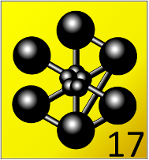

[`Cast3M`](http://www-cast3m.cea.fr) 2017 has been released.

A binary version of TFEL compiled for Cast3M 2017 is now available for
download on sourceforge:

<https://sourceforge.net/projects/tfel/files/>

# Non linear constraints with `MTest`

Arbitrary non linear constraints can be now imposed in `MTest` using
`@NonLinearConstraint` keyword.

## Applications

Abritray non linear constraints can be used to:

- Impose a constant stress triaxiality.
- Impose a constant first Piola-Kirchoff stress in a creep test
  described in finite strain.

## On the physical meaning of a constraint

A constraint \(c\) is imposed by introducing a Lagrange multiplier
\(\lambda\).

Consider a small strain elastic behaviour characterised by its free
energy \(\Psi\). In the only loading is the constraint \(c\), the
solution satisfies:
\[ \underset{\underline{\varepsilon},\lambda}{\min}\Psi-\lambda\,c \]

In this case, the constraint \(c\) is equivalent to the following
imposed stress:

\[
-\lambda\,\deriv{c}{\underline{\varepsilon}}
\]

If the constraint is \(\sigma_{xx}-\sigma_{0}\), where \(\sigma_{0}\)
is a constant value, the previous equation shows that imposing this
constraint *is not equivalent* to imposing an uniaxial stress state
\(\left(\sigma_{xx}\,0\,0\,0\,0\,0\right)\).

# [MFront Gallery] How to implement an isotropic viscoplastic behaviour with several kinematic variables following the Amstrong-Frederic evolution (27/03/2017)

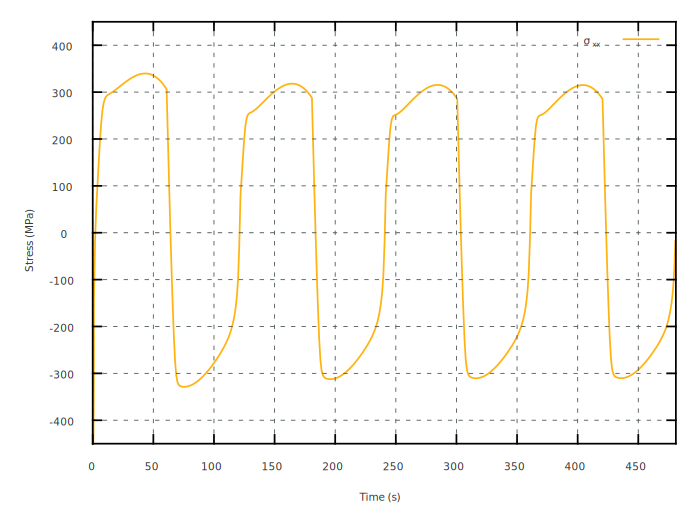

The implementation of an an isotropic viscoplastic behaviour with
several kinematic variables following the Amstrong-Frederic evolution
law is described
[here](isotropicplasticityamstrongfrederickinematichardening.html)

The behaviour is described by a standard split of the strain
\(\tepsilonto\) in an elastic and a plastic parts, respectively
denoted \(\tepsilonel\) and \(\tepsilonvis\):

\[
\tepsilonto=\tepsilonel+\tepsilonvis
\]

## Elastic behaviour

The stress \(\tsigma\) is related to the the elastic strain
\(\tepsilonel\) by a the standard Hooke behaviour:

\[
\tsigma = \lambda\,\trace{\tepsilonel}\,\tenseur{I}+2\,\mu\,\tepsilonel
\]

## Viscoplastic behaviour

The viscoplastic behaviour follows a standard viscoplastic behaviour:
\[
\tdepsilonvis=\left\langle\Frac{F}{K}\right\rangle^{m}\,\tenseur{n}=\dot{p}\,\tenseur{n}
\]

where \(F\) is the yield surface defined below, \(<.>\) is Macaulay
brackets, \(\tenseur{n}\) is the normal to \(F\) with respect to the
stress and \(p\) is the equivalent plastic strain.

The yield surface is defined by:
\[
F\paren{\tsigma,\tenseur{X}_{i},p}=\paren{\tsigma-\sum_{i=1}^{N}\tenseur{X}_{i}}_{\mathrm{eq}}-R\paren{p}=s^{e}_{\mathrm{eq}}-R\paren{p}
\]

where:

- \(R\paren{p}\) describes the isotropic hardening as a function
  of the equivalent viscoplastic strain \(p\).
- the \(N\) tensors \(\tenseur{X}_{i}\) (i\in\left[1,N\right]) are
  backstresses describing the kinematic hardening.
- \(\paren{.}_{\mathrm{eq}}\) is the Von Mises norm.

We have introduced an effective deviatoric stress \(\tenseur{s}^{e}\) defined by:
\[
\tenseur{s}^{e}=\tenseur{s}-\sum_{i=1}^{N}\tenseur{X}_{i}
\]
where \(\tenseur{s}\) is the deviatoric part of the stress.

The normal is then given by:
\[
\tenseur{n}=\deriv{F}{\tsigma}=\Frac{3}{2}\,\Frac{\tenseur{s}^{e}}{s^{e}_{\mathrm{eq}}}
\]

## Evolution of the isotropic hardening

The isotropic hardening is defined by:
\[
R\paren{p}=R_{\infty} + \paren{R_{0}-R_{\infty}}\,\exp\paren{-b\,p}
\]

## Evolution of the kinematic hardenings

\[
\tenseur{X}_{i}=\Frac{2}{3}\,C_{i}\,\tenseur{a}_{i}
\]

The evolution of the kinematic variables \(\tenseur{a}_{i}\) follows
the Armstrong-Frederic rule:

\[
\tenseur{\dot{a}}_{i}=\tdepsilonvis-g[i]\,\tenseur{a}_{i}\,\dot{p}=\dot{p}\,\paren{\tenseur{n}-g[i]\,\tenseur{a}_{i}}
\]

# Third MFront Users Day

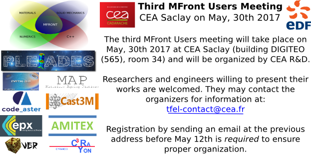

CEA and EDF are pleased to announce that the third MFront users
meeting will take place on May 30th 2017 and will be organized by CEA
DEC/SESC at CEA Saclay in the DIGITEO building (building 565, room
34). 

Researchers and engineers willing to present their works are welcome.

They may contact the organizers for information at:
[tfel-contact@cea.fr](mailto:tfel-contact@cea.fr).

Registration by sending an email at the previous address before May
12th is required to ensure proper organization.

# Announcing the `tfel-plot` project

The `tfel-plot` project is meant to create:

- a `C++11` library for generating `2D` plots based on the Qt library
  (version 4 or version 5).
- a drop-in replacement of `gnuplot` called `tplot`.

This project is based on:

- The [`TFEL` libraries](http://tfel.sourceforge.net).
- The [`Qt` framework](https://www.qt.io/) .

Compared to `gnuplot`, we wanted to introduced the following new
features:

- The ability to select a curve and modify its properties (color, line
  width, line style, etc..) interactively.
- The ability to use `tplot` from the command line.
- A widget that can be used in every `Qt` code.
- The ability to load `C` functions in shared libraries, such a the
  ones generated by the
  [`MFront` code generator](http://tfel.sourceforge.net).
- Usage of some features introduced by the `TFEL` project such as:
	- kriging interpolation.
	- the ability to differentiate functions using the `diff`
      operator.
- Support for themes.

More details can be found on the dedicated `github` page:

<https://github.com/thelfer/tfel-plot>

# [MFront Gallery] Description of the implementation of a simple orthotropic behaviour (27/01/2017)

A new example has been added in the gallery
[here](orthotropiclinearhardeningplasticity.html).

This example describes a simple orthotropic behaviour.

The behaviour is described by a standard split of the strain
\(\tepsilonto\) in an elastic and a plastic parts, respectively
denoted \(\tepsilonel\) and \(\tepsilonp\):

\[
\tepsilonto=\tepsilonel+\tepsilonp
\]

## Elastic behaviour

The stress \(\tsigma\) is related to the the elastic strain
\(\tepsilonel\) by a the orthotropic elastic stiffness
\(\tenseurq{D}\):

\[
\tsigma = \tenseurq{D}\,\colon\,\tepsilonel
\]

The plastic part of the behaviour is described by the following yield
surface:
\[
f\paren{\sigmaH,p} = \sigmaH-\sigma_{0}-R\,p
\]

where \(\sigmaH\) is the Hill stress defined below, \(p\) is the
equivalent plastic strain. \(\sigma_{0}\) is the yield stress and
\(R\) is the hardening slope.

The Hill stress \(\sigmaH\) is defined using the fourth order Hill
tensor \(H\):
\[
\sigmaH=\sqrt{\tsigma\,\colon\,\tenseurq{H}\colon\,\tsigma}
\]

The plastic flow is assumed to be associated, so the flow direction
\(\tenseur{n}\) is given by \(\deriv{f}{\tsigma}\):

\[
\tenseur{n} = \deriv{f}{\tsigma} = \Frac{1}{\sigmaH}\,\tenseurq{H}\,\colon\,\tsigma
\]

# New eigensolvers (23/01/2017)

The default eigen solver for symmetric tensors used in `TFEL` is based
on analitical computations of the eigen values and eigen vectors. Such
computations are more efficient but less accurate than the iterative
Jacobi algorithm (see [@kopp_efficient_2008;@kopp_numerical_2017]).

With the courtesy of Joachim Kopp, we have introduced the following
algorithms:

- Jacobi
- QL with implicit shifts
- Cuppen
- Analytical
- Hybrid
- Householder reduction

The implementation of Joachim Kopp have been updated for `C++-11` and
make more generic (support of all the floatting point numbers,
different types of matrix/vector objects). The algorithms have been
put in a separate namespace called `fses` (Fast Symmetric Eigen
Solver) and is independant of the rest of `TFEL`.

We have also introduced the Jacobi implementation of the `Geometric`
`Tools` library (see [@eberly_robust_2016;@eberly_geometric_2017]).

Those algorithms are available in 3D. For 2D symmetric tensors, we
fall back to some default algorithm as described below.

| Name                        | Algorithm  in 3D          | Algorithm  in 2D   |
|:---------------------------:|:-------------------------:|:------------------:|
| `TFELEIGENSOLVER`           | Analytical (TFEL)         | Analytical (TFEL)  |
| `FSESJACOBIEIGENSOLVER`     | Jacobi                    | Analytical (FSES)  |
| `FSESQLEIGENSOLVER`         | QL with implicit shifts   | Analytical (FSES)  |
| `FSESCUPPENEIGENSOLVER`     | Cuppen's Divide & Conquer | Analytical (FSES)  |
| `FSESANALYTICALEIGENSOLVER` | Analytical			      | Analytical (FSES)  |
| `FSESHYBRIDEIGENSOLVER`     | Hybrid				      | Analytical (FSES)  |
| `GTESYMMETRICQREIGENSOLVER` | Symmetric QR              | Analytical (TFEL)  |
: List of available eigen solvers. {#tbl:eigensolvers}

The various eigen solvers available are enumerated in Table
@tbl:eigensolvers.

The eigen solver is passed as a template argument of the
`computeEigenValues` or the `computeEigenVectors` methods as
illustrated in the code below:

~~~~~{.cpp}
tmatrix<3u,3u,real> m2;
tvector<3u,real>    vp2;
std::tie(vp,m)=s.computeEigenVectors<Stensor::GTESYMMETRICQREIGENSOLVER>();
~~~~~

|  Algorithm                  |  Failure ratio  | \(\Delta_{\infty}\) |   Times (ns)  |  Time ratio |
|:---------------------------:|:---------------:|:-------------------:|:-------------:|:-----------:|
| `TFELEIGENSOLVER`           |   0.000632      | 7.75e-14            |   252663338   |	1		    |
| `GTESYMMETRICQREIGENSOLVER` |   0             | 2.06e-15            |   525845499   |	2.08	    |
| `FSESJACOBIEIGENSOLVER`     |   0             | 1.05e-15            |   489507133   |	1.94	    |
| `FSESQLEIGENSOLVER`         |   0.000422      | 3.30e-15            |   367599140   |	1.45	    |
| `FSESCUPPENEIGENSOLVER`     |   0.020174      | 5.79e-15            |   374190684   |	1.48	    |
| `FSESHYBRIDEIGENSOLVER`     |   0.090065      | 3.53e-10            |   154911762   |	0.61	    |
| `FSESANALYTICALEIGENSOLVER` |   0.110399      | 1.09e-09            |   157613994   |	0.62	    |
: Test on \(10^{6}\) random symmetric tensors in double precision (`double`). {#tbl:comp_eigensolvers_double}

#### Some benchmarks

We have compared the available algorithm on \(10^{6}\) random
symmetric tensors whose components are in \([-1:1]\).

For a given symmetric tensor, we consider that the computation of the
eigenvalues and eigenvectors failed if:
\[
\Delta_{\infty}=\max_{i\in[1,2,3]}\left\|\tenseur{s}\,\cdot\,\vec{v}_{i}-\lambda_{i}\,\vec{v}_{i}\right\|>10\,\varepsilon
\]
where \(\varepsilon\) is the accuracy of the floatting point considered.

The results of those tests are reported on Table
@tbl:comp_eigensolvers_double:

- The standard eigen solver available in previous versions of `TFEL`
  offers a very interesting compromise between accuracy and numerical
  efficiency.
- If very accurate results are required, the `FSESJACOBIEIGENSOLVER`
  eigen solver is a good choice.

# Official port of `TFEL` for `FreeBSD` (20/01/2017)

Thanks to the work of Pedro F. Giffuni , an official port of
`TFEL/MFront` is available for `FreeBSD`:

<http://www.freshports.org/science/tfel/>

To install an executable package, you can now simply do:
 
~~~~{.sh}
pkg install tfel-mfront
~~~~

Alternativel, to build and install `TFEL` from the ports tree, one can
do:

~~~~{.sh}
cd /usr/ports/science/tfel/
make
make install
~~~~

# New hyper(visco)elastic behaviours in the MFront model repository (13/01/2017)

The implementation of the Ogden behaviour is now described in depth in
the following page:

<http://tfel.sourceforge.net/ogden.html>

This behaviour is interesting as it highlights the features introduced
in `TFEL-3.0` for computing isotropic functions of symmetric tensors.

This page uses the formal developments detailled in:

<http://tfel.sourceforge.net/hyperelasticity.html>

Concerning hyperviscoelasticity, a page describing a generic
implementation is available here:

<http://tfel.sourceforge.net/hyperviscoelasticity.html>

If you have particular wishes on behaviours implementation that you
would like to see treated, do not hesitate to send a message at
[tfel-contact@cea.fr](mailto:tfel-contact@cea.fr).

# MFront model repository (7/01/2017)

A page referencing examples of well written mechanical behaviours has
been created here:

<http://tfel.sourceforge.net/gallery.html>

For each behaviours, we will try to provide tutorial-like pages
explaining the implementations details (usage of tensorial objects,
special functions of the `TFEL` library, choice of the algorithms, and
so on...)

The first attempt is an hyperelastic behaviour already available in
`Code_Aster`: the Signorini behaviour. You can find the page here:

<http://tfel.sourceforge.net/signorini.html>

This is still under review, so corrections and feed-backs would be
greatly appreciated. The following behaviours are planned to be addressed:

- the Ogden hyperelastic behaviour which will show how we can compute
  eigenvalues, eigenvectors and isotropic functions of symmetric
  tensors.
- hyperviscoelasticity (a very small extension of hyperelasticity,
  indeed)
- simple plastic behaviours

If you have particular wishes on behaviours implementation that you
would like to see treated, do not hesitate to send a message at
[tfel-contact@cea.fr](mailto:tfel-contact@cea.fr).

# TFEL version 3.0 has been released the 16/12/2016.

From a user point of view, TFEL 3.0 brings many game-changing features:

- New mechanical behaviour interfaces to several finite element
  solvers (`Europlexus`, `Abaqus/Standard`, `Abaqus/Explicit`,
  `CalculiX`)
- The support of behaviours bricks.
- The ability to simulate pipes using a rigourous finite strain
  framework in `MTest`.
- The introduction of various accelerations algorithms used for
  solving the mechanical equilibrium when the consistent tangent
  operator is not available.
- The development of a stable API (application programming interface)
  in `C++` and `python` which allow building external tools upon
  `MFront` and `MTest`. This point is illustrated by the development
  by EDF MMC in the Material Ageing Plateform of a new identification
  tool which is particularly interesting.

Many improvements for mechanical behaviours have also been made:

- Definition and automatic computation of elastic material properties
  from external MFront files.
- Support for the automatic computation of the thermal expansion and
  swelling in the mechanical behaviour.
- Better support for orthotropic behaviours with the notion of
  orthotropic convention which affects various keywords
  (`@ComputeStiffnessTensor`, `@ComputeThermalExpansion`, `@Swelling`,
  `@AxialGrowth`, `@HillTensor` etc..).
- An initial support of non local mechanical behaviours.
- Time steps management from the mechanical behaviour.
- Consistent tangent operator support in the Cast3M interface.
- Easier computations of isotropic functions of symmetric tensors and
  their derivatives.
- New material properties interfaces for various programming languages
  (`fortran03`, `java`, `GNU/Octave`).

A detailed version of the release notes is available
[here](http://tfel.sourceforge.net/release-notes-3.0.html).

# A new behaviour implementation, called `UnilateralMazars` (1 June 2016)

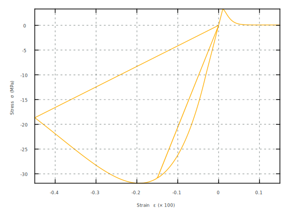

A new behaviour implementation has been submitted by F. Hamon (EDF R&D
AMA). This behaviour describes the damaging behaviour of concrete with
unilateral effects as described in a dedicated paper:

  > A new 3D damage model for concrete under monotonic, cyclic and
  > dynamic loadings.  Jacky Mazars, François Hamon and Stéphane
  > Grange. Materials and Structures ISSN 1359-5997 DOI
  > 10.1617/s11527-014-0439-8

This implementation can be found in the current development sources of
MFront.

# Progress in the Abaqus Explicit interface (VUMAT) (28 May 2016)

  <video style="display:block; margin: 0 auto;" width="640" height="320" controls>
    <source src="media/abaqus-explicit.mp4" type="video/mp4">
    Your browser does not support the video tag.
  </video>

The Abaqus Explicit interface is becoming quite usable du to the
extensive testing efforts of D. Deloison (Airbus). Here is an example
a punching test (This test was also modelled using Abaqus Standard).

# Documentation of behaviour bricks (27 May 2016)

~~~~{.cpp}
@Brick "StandardElasticity";
~~~~~~~~~~~~~~~~~~~~~~~~~~~~~~

Behaviour bricks will be one of the most important new feature of
`TFEL 3.0`.

A dedicated page has been created [here](BehaviourBricks.html)

# The `EUROPLEXUS` interface (27 May 2016)

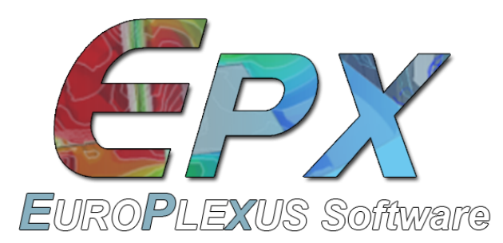

An interface for the EUROPLEXUS explicit finite element solver has
been developed.

[EUROPLEXUS](http://europlexus.jrc.ec.europa.eu/) (EPX) is a
simulation software dedicated to the analysis of fast transient
phenomena involving structures and fluids in interaction.

  <video style="display:block; margin: 0 auto;" width="640" height="320" controls>
    <source src="media/epx2.mp4" type="video/mp4">
    Your browser does not support the video tag.
  </video>

See the [dedicated page](epx.html) for more information.

# `tfel-doc` `github` repository. Talks of the Second MFront Users Day (27 May 2016)

A `github` repository has been set up to store various documents
describing TFEL and MFront usage. The talks of the first and second
MFront Users Days are available there:

<https://github.com/thelfer/tfel-doc>

# TFEL `github` repository (27 May 2016)

The `subversion` repository used by CEA and EDF are now synchronized
with a public `githbub` repository:

<https://github.com/thelfer/tfel>

All the branches, commit description and history of TFEL are
available. This repository is read-only. Its purpose is to integrate
TFEL in continous-integration projects which depends on TFEL.

# Announcing the `mfront` module (May 2016)

A new `python` module has been introduced to analyse `MFront` files.

An overview of the module is available [here](mfront-python.html).

Here is a typical usage example:

~~~~{.python}
import mfront

dsl = mfront.getDSL("Chaboche.mfront")
dsl.setInterfaces(["aster"])
dsl.analyseFile("Chaboche.mfront",[])

# file description
fd = dsl.getFileDescription()
print("file author:      ", fd.authorName)
print("file date:        ", fd.date)
print("file descrption:\n", fd.description)

# targets information
tgt = dsl.getTargetsDescription()

# loop over (to be) generated libraries
for l in tgt:
	print(l)
~~~~

# Cast3m 2016 is out (28 April 2016)

[`Cast3M`](http://www-cast3m.cea.fr) 2016 has been released.

This version allow even better integration with `MFront` and can now
directly be used to make direct calls to `MFront` libraries for
material properties (mechanical behaviours can be used since Cast3M
2015). 

This syntax is now officially supported:

~~~~{.python}
Ty = 'TABLE' ;
Ty.'LIB_LOI'   = 'libCastemM5.so' ;
Ty.'FCT_LOI'   = 'M5_YoungModulus' ;
Ty.'VARIABLES' = 'MOTS' 'T';

mo = 'MODELISER' m 'MECANIQUE' 'ELASTIQUE';
ma = 'MATERIAU' mo 'YOUN' Ty 'NU' 0.3;
~~~~

A binary version of TFEL compiled for Cast3M 2016 is now available for
download on sourceforge:

<https://sourceforge.net/projects/tfel/files/>

# Second MFront Users Day

CEA and EDF are pleased to announce that the second MFront users
meeting will take place on May 20th 2016 and will be organized by EDF
R&D at the EDF Lab Paris Saclay location.

Researchers and engineers willing to present their works are
welcome. They may contact the organizers for information at:
[tfel-contact@cea.fr](mailto:tfel-contact@cea.fr).

This users day will take place on Friday, May 20th, 2016 at EDF Lab
Paris-Saclay (access map).

Registration is required to ensure proper organization. See the
dedicated form on the Code_Aster website: [http://www.code-aster.org/spip.php?article906](http://www.code-aster.org/spip.php?article906)

# Abaqus interface

The current development version now includes an experimental interface
to the
[`Abaqus`](http://www.3ds.com/products-services/simulia/products/abaqus/)
solver through the `umat` subroutine.

The following results shows the results obtained on notched beam under
a cyclic loading with an isotropic hardening plastic beahviour
implemented with `mfront`:

The `mfront` results can be compared to the results obtained using
`Abaqus` in-built model on the following figure:

The `Abaqus` interface is still in its early stage of developments. A
full description of its usage and current abilities can be found in
the associated [documentation](documents/mfront/abaqus.pdf).

Feed-back from users would be greatly welcomed.

# IMSIA Seminar about MFront on Januar, 27 2016

An IMSIA seminar about MFront will be held on Januar, 27 2016. Here is
the official announcement (in french):

  > Séminaire IMSIA : Implémentation de lois de comportement mécanique
  > à l’aide du générateur de code MFront
  >
  > Créé dans le cadre de la simulation des éléments combustibles
  > nucléaire au sein d’une plate-forme logicielle nommée PLEIADES,
  > MFront est un générateur de code, distribué en open-source [1],
  > qui vise à permettre aux ingénieurs/chercheurs d’implémenter de
  > manière simple et rapide des lois de comportements mécaniques de
  > manière indépendante du code cible (EF ou FTT) [2,3].
  >
  > Ce dernier point permet d’échanger les lois MFront entre différents
  > partenaires, universitaires ou industriels. Le lien vers les codes
  > cible se fait via la notion d’interface. A l’heure actuelle, des
  > interfaces existent pour les codes Cast3M, Code-Aster, Abaqus,
  > ZeBuLoN, AMITEX_FFT et d’autres codes métiers, et sont en cours de
  > développement pour d’autres codes tels Europlexus, …
  > 
  > Ce séminaire proposera une description des fonctionnalités de
  > MFront (lois en transformations infinitésimales et en grandes
  > transformations, modèles de zones cohésives) et commentera
  > plusieurs exemples d’applications, discutera des performances
  > numériques obtenues et soulèvera la question de la portabilité des
  > connaissances matériau. Nous montrerons qu’une démarche cohérente
  > allant des expérimentations aux codes de calcul est nécessaire.
  > 
  > [1] http://tfel.sourceforge.net
  >
  > [2] Introducing the open-source mfront code generator: Application
  > to mechanical behaviours and material knowledge management within
  > the PLEIADES fuel element modelling platform. Thomas Helfer, Bruno
  > Michel, Jean-Michel Proix, Maxime Salvo, Jérôme Sercombe, Michel
  > Casella, Computers & Mathematics with Applications, Volume 70,
  > Issue 5, September 2015, Pages 994-1023, ISSN 0898-1221,
  > http://dx.doi.org/10.1016/j.camwa.2015.06.027.
  > 
  > [3] Implantation de lois de comportement mécanique à l’aide de
  > MFront : simplicité, efficacité, robustesse et
  > portabilité. T. Helfer, J.M. Proix, O. Fandeur. 12ème Colloque
  > National en Calcul des Structures 18-22 Mai 2015, Giens (Var)

# MFront and Cyrano3 at the LWR Fuel Performance Meeting 2015 (13 - 17 September 2015, Zurich, Switzerland)

A poster describing the use of `MFront` in EDF `Cyrano3` fuel
performance code has been presented at the LWR Fuel Performance
Meeting 2015 (13 - 17 September 2015, Zurich, Switzerland):

- [abstract](https://github.com/thelfer/tfel-doc/blob/master/Papers/TopFuel2015/topfuel2015.pdf)
- [poster](https://github.com/thelfer/tfel-doc/blob/master/Papers/TopFuel2015/topfuel2015-poster.pdf)

# Release of version 2.0.3 (9 September 2015)

Version 2.0.3 is mostly a bug-fix release:

- Fix of a minor bug in the `CxxTokenizer` class which was appears
  when using the [`clang` `libc++`](http://libcxx.llvm.org/) standard
  library. This prevented many `MTest` tests to work on
  [Mac OS X](http://www.apple.com/fr/osx/).
- Fix of [Ticket #9](https://sourceforge.net/p/tfel/tickets/9/)
- Fix of [Ticket #10](https://sourceforge.net/p/tfel/tickets/10/)
- Fix of [Ticket #11](https://sourceforge.net/p/tfel/tickets/11/)
- The class `ExternalBehaviourDescription` was introduced
- The `AxialGrowth` entry was added to the glossary

A full description of the 2.0.3 release can be found
[here](documents/tfel/tfel-2.0.3.pdf) (in french).

# Introducting `mfront-doc` (19 August 2015)

`mfront-doc` allows the user to extract the documentation out of
`MFront` file. `mfront-doc` generates files in `pandoc`
[markdown format](http://pandoc.org/demo/example9/pandocs-markdown.html). Those
files can be processed using [`pandoc`](http://pandoc.org/) and be
converted to one of the many file format supported by
[`pandoc`](http://pandoc.org/), including
[`LaTeX`](www.latex-project.org), `html` or various Word processor
formats: Microsoft Word
[docx](http://www.microsoft.com/interop/openup/openxml/default.aspx),
OpenOffice/LibreOffice
[ODT](http://en.wikipedia.org/wiki/OpenDocument).

`mfront-doc` is developped in the 3.0.x branche of `TFEL`. A overview
of the `mfront-doc` functionalities can be found
[here](mfront-doc.html).

# New documentations pages (18 August 2015)

New documentation pages were added to describe the `MTest` and
`MFront` keywords:

- `MFront` keywords, sorted by domain specific languages:
    + [DefaultDSL](DefaultDSL-keywords.html) 
    + [DefaultCZMDSL](DefaultCZMDSL-keywords.html) 
    + [DefaultFiniteStrainDSL](DefaultFiniteStrainDSL-keywords.html) 
    + [Implicit](Implicit-keywords.html) 
    + [ImplicitFiniteStrain](ImplicitFiniteStrain-keywords.html) 
    + [ImplicitII](ImplicitII-keywords.html) 
    + [IsotropicMisesCreep](IsotropicMisesCreep-keywords.html) 
    + [IsotropicPlasticMisesFlow](IsotropicPlasticMisesFlow-keywords.html) 
    + [IsotropicStrainHardeningMisesCreep](IsotropicStrainHardeningMisesCreep-keywords.html) 
    + [MaterialLaw](MaterialLaw-keywords.html) 
    + [Model](Model-keywords.html) 
    + [MultipleIsotropicMisesFlows](MultipleIsotropicMisesFlows-keywords.html) 
    + [RungeKutta](RungeKutta-keywords.html) 
- [`MTest` keywords](MTest-keywords.html)

# New interfaces for material properties (July 2015)

The current development version of `MFront` includes two new
interfaces for material properties:

- `java` designed for the
  [`java` language](http://www.oracle.com/fr/java/overview/index.html).
- `octave` designed for
  [`GNU Octave`](https://www.gnu.org/software/octave/) which is a
  high-level interpreted language, primarily intended for numerical
  computations.

Here is an example of a
[`GNU Octave`](https://www.gnu.org/software/octave/) session used to
compute the Young Modulus of uranium-plutonium carbide \(UPuC\) for
various porosities over a range of temperatures:

~~~~ {.octave}
octave:1> T=[300:100:1500]
T =
    300    400    500    600    700    800    900   1000   1100   1200   1300   1400   1500
octave:2> y01=UPuC_YoungModulus(T,0.1)
y01 =
   1.7025e+11   1.6888e+11   1.6752e+11   1.6616e+11   1.6480e+11   1.6344e+11   1.6207e+11   1.6071e+11   1.5935e+11   1.5799e+11   1.5662e+11   1.5526e+11   1.5390e+11
octave:3> y02=UPuC_YoungModulus(T,0.2)
y02 =
   1.1853e+11   1.1758e+11   1.1663e+11   1.1568e+11   1.1474e+11   1.1379e+11   1.1284e+11   1.1189e+11   1.1094e+11   1.0999e+11   1.0905e+11   1.0810e+11   1.0715e+11
~~~~~~~~

# A "publications" page has been added to the website (July 2015)

The number of papers in which `MFront` is used is increasing. A
dedicated page has been added [here](publications.html).

If you publish papers which refers to `MFront`, please consider
contributing to this page.

# The paper entitled "Introducing the open-source MFront code generator ..." has been accepted for publication in Computers and Mathematics with Applications (24 june 2015)

The first paper dedicated to `MFront`, written by Thomas Helfer, Bruno
Michel, Jean-Michel Proix, Maxime Salvo, Jérôme Sercombe, and Michel
Casella, has been accepted Computers and Mathematics with
Applications. The paper is available online on the sciencedirect
website:

<http://www.sciencedirect.com/science/article/pii/S0898122115003132>

 > The PLEIADES software environment is devoted to the
 > thermomechanical simulation of nuclear fuel elements behaviour
 > under irradiation. This platform is co-developed in the framework
 > of a research cooperative program between Électricité de France
 > (EDF), AREVA and the French Atomic Energy Commission
 > (CEA). As many thermomechanical solvers are used within the
 > platform, one of the PLEAIADES’s main challenge is to propose a
 > unified software environment for capitalisation of material
 > knowledge coming from research and development programs on various
 > nuclear systems.
 >
 > This paper introduces a tool called mfront which is basically a
 > code generator based on C++ (Stroustrup and Eberhardt,
 > 2004). Domain specific languages are provided which were designed
 > to simplify the implementations of new material properties,
 > mechanical behaviours and simple material models. mfront was
 > recently released under the GPL open-source licence and is
 > available on its web site: http://tfel.sourceforge.net/.
 >
 > The authors hope that it will prove useful for researchers and
 > engineers, in particular in the field of solid mechanics. mfront
 > interfaces generate code specific to each solver and language
 > considered.
 > 
 > In this paper, after a general overview of mfront functionalities,
 > a particular focus is made on mechanical behaviours which are by
 > essence more complex and may have significant impact on the
 > numerical performances of mechanical simulations. mfront users can
 > describe all kinds of mechanical phenomena, such as
 > viscoplasticity, plasticity and damage, for various types of
 > mechanical behaviour (small strain or finite strain behaviour,
 > cohesive zone models). Performance benchmarks, performed using the
 > Code-Aster finite element solver, show that the code generated
 > using mfront is in most cases on par or better than the behaviour
 > implementations written in fortran natively available in this
 > solver. The material knowledge management strategy that was set up
 > within the PLEIADES platform is briefly discussed. A material
 > database named sirius proposes a rigorous material verification
 > workflow.
 > 
 > We illustrate the use of mfront through two case of studies: a
 > simple FFC single crystal viscoplastic behaviour and the
 > implementation of a recent behaviour for the fuel material which
 > describes various phenomena: fuel cracking, plasticity and
 > viscoplasticity.

# Castem 2015 is out (12 April 2015)

[`Cast3M`](http://www-cast3m.cea.fr) 2015 has been released.

This release allow direct call to `MFront` libraries for mechanical
behaviours. The following syntax of the `MODELISER` operator is now
officially supported:

~~~~{.python}
mod1 = 'MODELISER' s1 'MECANIQUE' 'ELASTIQUE' 'ISOTROPE'
   'NON_LINEAIRE' 'UTILISATEUR'
   'LIB_LOI' 'src/libUmatBehaviour.so'
   'FCT_LOI' 'umatnorton'
   'C_MATERIAU' coel2D
   'C_VARINTER' stav2D
   'PARA_LOI'   para2D
   'CONS' M;
~~~~

See the [dedicated page](castem.html) for more information.

# `Salome-Meca` 2015.1 is out (1O April 2015)

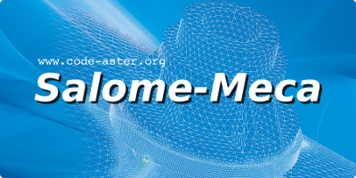

`Salome-Meca` 2015.1, which combines the
 [`Salome` platform](http://www.salome-platform.org/) and
 [`Code-Aster`](http://www.code-aster.org/), has been released on 1O
 April 2015. This version is the first to include a pre-packaged
 version of `TFEL` (version 2.0.1).

# `Salome-Meca` and `Code_Aster` Users Day (26 March 2015)

A presentation of `MFront` was done during the `Salome-Meca` and
`Code_Aster` Users Day 2015 user meeting at EDF Lab Clamart.

Slides can be found [here](https://github.com/thelfer/tfel-doc/tree/master/Talks/CodeAsterUserDays2015).

# `MFront` user meeting (6 Februar 2015)

The first `MFront` user meeting was held in Cadarache on
Februar,6 2015. 27 participants from CEA, EDF, Areva and CNRS could
discuss and comment about their use of MFront.

Various subjects were discussed:

- Introduction to the user meeting
- New functionalities introduced in `TFEL`/`MFront` 2.0
- Feed-back from users:
    - Feed-back from the `Code-Aster` development team
	- Feed-back from the `Cyrano3` development team
- Modèle de couplage Fluage/Endommagement/Réaction Alcali Granulat (RAG) du béton
- Modélisation à différentes échelles du comportement mécanique du dioxyde d'uranium
- Writing portable behaviour with `MFront`
- On the road to `TFEL 3.x`

Those talks are available
[here](https://github.com/thelfer/tfel-doc/tree/master/MFrontUserDays/FirstUserDay)

# First `MFront` user meeting (12 December 2014)

We are glad to announce that the first `MFront` user meeting will be
held in Cadarache on Februar,6 2015. Everyone is invited but a
registration must be performed before Januar, 16 2015
([tfel-contact@cea.fr](mailto:tfel-contact@cea.fr)).

Various subjects are already planned:

- New functionalities introduced in `TFEL`/`MFront` 2.0
- Feed-back from users:
    - Feed-back from the `Code-Aster` development team
	- Feed-back from the `Cyrano3` development team
- `MFront` usage for concrete modelling
- Examples of `MFront` usage in finite strain analyses
- Application of `MFront` to nuclear fuel modelling
- How to write portable behaviour implementations ?
- Conclusions

Other talks are welcomed.

# Some applications of `MFront` at the [`Cast3M`](http://www-cast3m.cea.fr) user meeting  (4 December 2014)

The [`Cast3M`](http://www-cast3m.cea.fr) user meeting was held in
Paris on November 28, 2014. Jérémy Hure had a talk about the
application of `MFront` in finite strain elasto-plasticity. This talk
is available
[here](https://github.com/thelfer/tfel-doc/tree/master/Talks/Cast3MUserDays2014).

# `AMITEX_FFTP` has its own website (4 December 2014)

[`AMITEX_FFTP`](http://www.maisondelasimulation.fr/projects/amitex/html/)
has now its own
[dedicated webiste](](http://www.maisondelasimulation.fr/projects/amitex/html/)).

The main purpose of
[`AMITEX_FFTP`](http://www.maisondelasimulation.fr/projects/amitex/html/)
is to implement an efficient distributed mechanical solver based on
Fast Fourier
Transform. [`AMITEX_FFTP`](http://www.maisondelasimulation.fr/projects/amitex/html/)
is developped by CEA in the Departement of Nuclear
Material.

[`AMITEX_FFTP`](http://www.maisondelasimulation.fr/projects/amitex/html/)
is distributed under a free license for research and education
purpose.

# Release of TFEL version 2.0.1 (2 December 2014)

`TFEL` version 2.0.1 is now available. This is mainly a bug-fix
release after version 2.0.0.

This version is meant to be used in Code-Aster version 12.3 that will
be released in January 2015.

# Creation of the [tfel-contact@cea.fr](mailto:tfel-contact@cea.fr) address (1 December 2014)

A new contact address has been created:
[tfel-contact@cea.fr](mailto:tfel-contact@cea.fr).

This address can be used to contact directly the developers of `TFEL`
and `MFront` for specific issues. However, if your issue may interest
a broader audience, you may want to send a post to the TFEL users
mailing lists:
[tfel-discuss](mailto:tfel-discuss@lists.sourceforge.net).

# `MFront` talk at Materiaux 2014 Montpellier (24 November 2014)

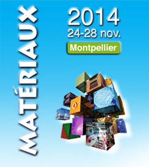

An `MFront` talk was given at Materiaux 2014. Slides (in french) are
available [here](https://github.com/thelfer/tfel-doc/tree/master/Talks/Materiaux2014).

# Beta release of tfel-2.0.1 for `Windows 64bits` and `Cast3M 2014` (18 November 2014)

A beta version of tfel-2.0.1 for `Windows 64bits` and [`Cast3M`](http://www-cast3m.cea.fr) `2014`
has been released. A binary installer is provided
[here](http://sourceforge.net/projects/tfel/files/Devel/Cast3M-2014/).

Installing this version requires a functional installation of
[`Cast3M`](http://www-cast3m.cea.fr) \(2014\) (which shall be
[patched](downloads/patchs-Cast3M-2014.tar.bz2) to call external
libraries) and the `MSYS` shell (It is recommended not to install
`mingw` compilers along with the `MSYS` shell as [`Cast3M`](http://www-cast3m.cea.fr) provides its
own version of those compilers).

Installation instructions of those requirements are available
[here](install-windows.html).

Any feedback would be gratefully acknowledge.

**Note:** The binary provided requires the `mingw` libraries delivered
with [`Cast3M`](http://www-cast3m.cea.fr) `2014`. 

**Note:** A standalone version of tfel-2.0.1 will be provided shortly. 

# `MFront` behaviours can now be used in `AMITEX_FFTP` (24 October 2014)

`AMITEX_FFTP` is a massively parallel mechanical solver based on FFT
developed at CEA. `MFront` behaviours can be used in `AMITEX_FFTP`
through the `UMAT` interface introduced by the
[`Cast3M`](http://www-cast3m.cea.fr) finite element solver.

 voxels)")

# `TFEL/MFront` on [`Cast3M`](http://www-cast3m.cea.fr) web site (15 October 2014)

[A page dedicated](http://www-cast3m.cea.fr/index.php?xml=mfront) to
`MFront` is now available on the [`Cast3M`](http://www-cast3m.cea.fr)
web site.

# Release of TFEL 2.0 (1 October 2014)

Here is the official announcement by Jean-Paul DEFFAIN (in French):

  > Bonjour,
  > 
  > Une version libre de MFront est désormais officiellement disponible
  > sous licence GPL et CECILL-A.
  > 
  > Cette version 2.0 permet entre autres de générer des lois de
  > comportements en transformations infinitésimales et en grandes
  > transformations ainsi que des modèles de zones cohésives. Les lois
  > générées sont utilisables dans les codes aux éléments finis Cast3M,
  > Code-Aster, ZeBuLoN, l’ensemble des applications développées dans la
  > plateforme PLEIADES, notamment Cyrano3, et le solveur FFT de la
  > plate-forme. Des interfaces vers d'autres codes peuvent être
  > rajoutées.
  > 
  > Un projet dédié a été crée sur sourceforge
  > (<http://sourceforge.net/projects/tfel>) et fournit :
  > 
  > - un site dédié (<http://tfel.sourceforge.net>)
  > - un espace de téléchargement
  >   (<http://sourceforge.net/projects/tfel/files>) qui permet d'accéder
  >   à la version 2.0
  > - les listes de diffusion tfel-announce et tfel-discuss
  >   (<http://sourceforge.net/p/tfel/tfel>)
  > - un forum (<http://sourceforge.net/p/tfel/discussion>)
  > - un outil de demande d'évolution et de déclaration de bugs par
  >   tickets (<http://sourceforge.net/p/tfel/tickets>)
  > 
  > Pour les personnes souhaitant contribuer au développement, le dépôt
  > subversion est accessible sur le serveur:
  > 
  > <https://svn-pleiades.cea.fr/SVN/TFEL>
  > 
  > L’accès à ce dépôt est restreint mais nécessite l’ouverture d’un
  > compte spécifique sur demande au
  > [chef du projet PLEIADES](mailto:tfel-contact@cea.fr).
  > 
  > Nous remercions chaleureusement tous ceux qui ont contribué à cette
  > version et invitons toutes les personnes intéressées à se joindre au
  > développement de MFront.
  > 
  > Jean-Paul DEFFAIN
  > 
  > Chef du programme SIMU
  > 
  > Commissariat à l'Énergie Atomique

# References

<!-- Local IspellDict: english -->
