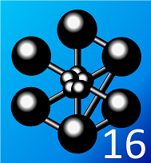
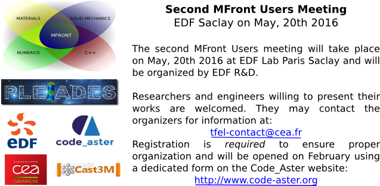
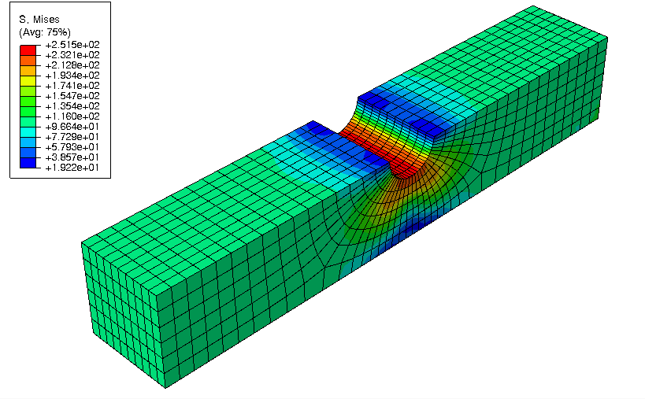
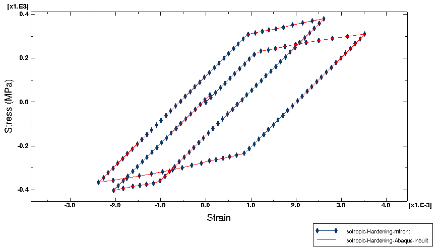
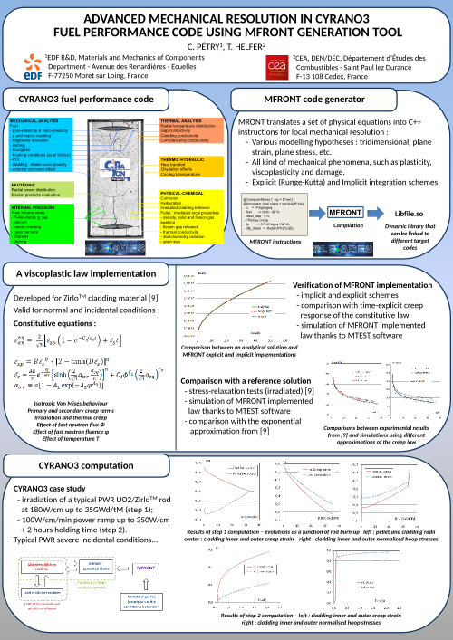
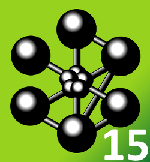
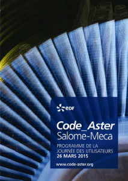

% News
% Helfer Thomas
% Janvier 19, 2016

# Cast3m 2016 is out (28 April 2016)

[`Cast3M`](http://www-cast3m.cea.fr) 2016 has been released.

This version allow even better integration with `MFront` and can now
directly be used to make direct calls to `MFront` libraries for
material properties (mechanical behaviours can be used since Cast3M
2015). 

This syntax is now officially supported:

~~~~{.python}
Ty = 'TABLE' ;
Ty.'LIB_LOI'   = 'libCastemM5.so' ;
Ty.'FCT_LOI'   = 'M5_YoungModulus' ;
Ty.'VARIABLES' = 'MOTS' 'T';

mo = 'MODELISER' m 'MECANIQUE' 'ELASTIQUE';
ma = 'MATERIAU' mo 'YOUN' Ty 'NU' 0.3;
~~~~

A binary version of TFEL compiled for Cast3M 2016 is now available for
download on sourceforge:

<https://sourceforge.net/projects/tfel/files/>

# Second MFront Users Day

CEA and EDF are pleased to announce that the second MFront users
meeting will take place on May 20th 2016 and will be organized by EDF
R&D at the EDF Lab Paris Saclay location.

Researchers and engineers willing to present their works are
welcome. They may contact the organizers for information at:
[tfel-contact@cea.fr](mailto:tfel-contact@cea.fr).

This users day will take place on Friday, May 20th, 2016 at EDF Lab
Paris-Saclay (access map).

Registration is required to ensure proper organization. See the
dedicated form on the Code_Aster website: [http://www.code-aster.org/spip.php?article906](http://www.code-aster.org/spip.php?article906)

# Abaqus interface

The current development version now includes an experimental interface
to the
[`Abaqus`](http://www.3ds.com/products-services/simulia/products/abaqus/)
solver through the `umat` subroutine.

The following results shows the results obtained on notched beam under
a cyclic loading with an isotropic hardening plastic beahviour
implemented with `mfront`:

The `mfront` results can be compared to the results obtained using
`Abaqus` in-built model on the following figure:

The `Abaqus` interface is still in its early stage of developments. A
full description of its usage and current abilities can be found in
the associated [documentation](documents/mfront/abaqus.pdf).

Feed-back from users would be greatly welcomed.

# IMSIA Seminar about MFront on Januar, 27 2016

An IMSIA seminar about MFront will be held on Januar, 27 2016. Here is
the official announcement (in french):

  > Séminaire IMSIA : Implémentation de lois de comportement mécanique
  > à l’aide du générateur de code MFront
  >
  > Créé dans le cadre de la simulation des éléments combustibles
  > nucléaire au sein d’une plate-forme logicielle nommée PLEIADES,
  > MFront est un générateur de code, distribué en open-source [1],
  > qui vise à permettre aux ingénieurs/chercheurs d’implémenter de
  > manière simple et rapide des lois de comportements mécaniques de
  > manière indépendante du code cible (EF ou FTT) [2,3].
  >
  > Ce dernier point permet d’échanger les lois MFront entre différents
  > partenaires, universitaires ou industriels. Le lien vers les codes
  > cible se fait via la notion d’interface. A l’heure actuelle, des
  > interfaces existent pour les codes Cast3M, Code-Aster, Abaqus,
  > ZeBuLoN, AMITEX_FFT et d’autres codes métiers, et sont en cours de
  > développement pour d’autres codes tels Europlexus, …
  > 
  > Ce séminaire proposera une description des fonctionnalités de
  > MFront (lois en transformations infinitésimales et en grandes
  > transformations, modèles de zones cohésives) et commentera
  > plusieurs exemples d’applications, discutera des performances
  > numériques obtenues et soulèvera la question de la portabilité des
  > connaissances matériau. Nous montrerons qu’une démarche cohérente
  > allant des expérimentations aux codes de calcul est nécessaire.
  > 
  > [1] http://tfel.sourceforge.net
  >
  > [2] Introducing the open-source mfront code generator: Application
  > to mechanical behaviours and material knowledge management within
  > the PLEIADES fuel element modelling platform. Thomas Helfer, Bruno
  > Michel, Jean-Michel Proix, Maxime Salvo, Jérôme Sercombe, Michel
  > Casella, Computers & Mathematics with Applications, Volume 70,
  > Issue 5, September 2015, Pages 994-1023, ISSN 0898-1221,
  > http://dx.doi.org/10.1016/j.camwa.2015.06.027.
  > 
  > [3] Implantation de lois de comportement mécanique à l’aide de
  > MFront : simplicité, efficacité, robustesse et
  > portabilité. T. Helfer, J.M. Proix, O. Fandeur. 12ème Colloque
  > National en Calcul des Structures 18-22 Mai 2015, Giens (Var)

# MFront and Cyrano3 at the LWR Fuel Performance Meeting 2015 (13 - 17 September 2015, Zurich, Switzerland)

A poster describing the use of `MFront` in EDF `Cyrano3` fuel
performance code has been presented at the LWR Fuel Performance
Meeting 2015 (13 - 17 September 2015, Zurich, Switzerland):

- [abstract](documents/articles/topfuel2015.pdf)
- [poster](documents/articles/topfuel2015-poster.pdf)

# Release of version 2.0.3 (9 September 2015)

Version 2.0.3 is mostly a bug-fix release:

- Fix of a minor bug in the `CxxTokenizer` class which was appears
  when using the [`clang` `libc++`](http://libcxx.llvm.org/) standard
  library. This prevented many `MTest` tests to work on
  [Mac OS X](http://www.apple.com/fr/osx/).
- Fix of [Ticket #9](https://sourceforge.net/p/tfel/tickets/9/)
- Fix of [Ticket #10](https://sourceforge.net/p/tfel/tickets/10/)
- Fix of [Ticket #11](https://sourceforge.net/p/tfel/tickets/11/)
- The class `ExternalBehaviourDescription` was introduced
- The `AxialGrowth` entry was added to the glossary

A full description of the 2.0.3 release can be found
[here](documents/tfel/tfel-2.0.3.pdf) (in french).

# Introducting `mfront-doc` (19 August 2015)

`mfront-doc` allows the user to extract the documentation out of
`MFront` file. `mfront-doc` generates files in `pandoc`
[markdown format](http://pandoc.org/demo/example9/pandocs-markdown.html). Those
files can be processed using [`pandoc`](http://pandoc.org/) and be
converted to one of the many file format supported by
[`pandoc`](http://pandoc.org/), including
[`LaTeX`](www.latex-project.org), `html` or various Word processor
formats: Microsoft Word
[docx](http://www.microsoft.com/interop/openup/openxml/default.aspx),
OpenOffice/LibreOffice
[ODT](http://en.wikipedia.org/wiki/OpenDocument).

`mfront-doc` is developped in the 3.0.x branche of `TFEL`. A overview
of the `mfront-doc` functionalities can be found
[here](mfront-doc.html).

# New documentations pages (18 August 2015)

New documentation pages were added to describe the `MTest` and
`MFront` keywords~:

- `MFront` keywords, sorted by domain specific languages:
    + [DefaultDSL](DefaultDSL-keywords.html) 
    + [DefaultCZMDSL](DefaultCZMDSL-keywords.html) 
    + [DefaultFiniteStrainDSL](DefaultFiniteStrainDSL-keywords.html) 
    + [Implicit](Implicit-keywords.html) 
    + [ImplicitFiniteStrain](ImplicitFiniteStrain-keywords.html) 
    + [ImplicitII](ImplicitII-keywords.html) 
    + [IsotropicMisesCreep](IsotropicMisesCreep-keywords.html) 
    + [IsotropicPlasticMisesFlow](IsotropicPlasticMisesFlow-keywords.html) 
    + [IsotropicStrainHardeningMisesCreep](IsotropicStrainHardeningMisesCreep-keywords.html) 
    + [MaterialLaw](MaterialLaw-keywords.html) 
    + [Model](Model-keywords.html) 
    + [MultipleIsotropicMisesFlows](MultipleIsotropicMisesFlows-keywords.html) 
    + [RungeKutta](RungeKutta-keywords.html) 
- [`MTest` keywords](MTest-keywords.html)

# New interfaces for material properties (July 2015)

The current development version of `MFront` includes two new
interfaces for material properties:

- `java` designed for the
  [`java` language](http://www.oracle.com/fr/java/overview/index.html).
- `octave` designed for
  [`GNU Octave`](https://www.gnu.org/software/octave/) which is a
  high-level interpreted language, primarily intended for numerical
  computations.

Here is an example of a
[`GNU Octave`](https://www.gnu.org/software/octave/) session used to
compute the Young Modulus of uranium-plutonium carbide \(UPuC\) for
various porosities over a range of temperatures:

~~~~ {.octave}
octave:1> T=[300:100:1500]
T =
    300    400    500    600    700    800    900   1000   1100   1200   1300   1400   1500
octave:2> y01=UPuC_YoungModulus(T,0.1)
y01 =
   1.7025e+11   1.6888e+11   1.6752e+11   1.6616e+11   1.6480e+11   1.6344e+11   1.6207e+11   1.6071e+11   1.5935e+11   1.5799e+11   1.5662e+11   1.5526e+11   1.5390e+11
octave:3> y02=UPuC_YoungModulus(T,0.2)
y02 =
   1.1853e+11   1.1758e+11   1.1663e+11   1.1568e+11   1.1474e+11   1.1379e+11   1.1284e+11   1.1189e+11   1.1094e+11   1.0999e+11   1.0905e+11   1.0810e+11   1.0715e+11
~~~~~~~~

# A "publications" page has been added to the website (July 2015)

The number of papers in which `MFront` is used is increasing. A
dedicated page has been added [here](publications.html).

If you publish papers which refers to `MFront`, please consider
contributing to this page.

# The paper entitled "Introducing the open-source MFront code generator ..." has been accepted for publication in Computers and Mathematics with Applications (24 june 2015)

The first paper dedicated to `MFront`, written by Thomas Helfer, Bruno
Michel, Jean-Michel Proix, Maxime Salvo, Jérôme Sercombe, and Michel
Casella, has been accepted Computers and Mathematics with
Applications. The paper is available online on the sciencedirect
website:

<http://www.sciencedirect.com/science/article/pii/S0898122115003132>

 > The PLEIADES software environment is devoted to the
 > thermomechanical simulation of nuclear fuel elements behaviour
 > under irradiation. This platform is co-developed in the framework
 > of a research cooperative program between Électricité de France
 > (EDF), AREVA and the French Atomic Energy Commission
 > (CEA). As many thermomechanical solvers are used within the
 > platform, one of the PLEAIADES’s main challenge is to propose a
 > unified software environment for capitalisation of material
 > knowledge coming from research and development programs on various
 > nuclear systems.
 >
 > This paper introduces a tool called mfront which is basically a
 > code generator based on C++ (Stroustrup and Eberhardt,
 > 2004). Domain specific languages are provided which were designed
 > to simplify the implementations of new material properties,
 > mechanical behaviours and simple material models. mfront was
 > recently released under the GPL open-source licence and is
 > available on its web site: http://tfel.sourceforge.net/.
 >
 > The authors hope that it will prove useful for researchers and
 > engineers, in particular in the field of solid mechanics. mfront
 > interfaces generate code specific to each solver and language
 > considered.
 > 
 > In this paper, after a general overview of mfront functionalities,
 > a particular focus is made on mechanical behaviours which are by
 > essence more complex and may have significant impact on the
 > numerical performances of mechanical simulations. mfront users can
 > describe all kinds of mechanical phenomena, such as
 > viscoplasticity, plasticity and damage, for various types of
 > mechanical behaviour (small strain or finite strain behaviour,
 > cohesive zone models). Performance benchmarks, performed using the
 > Code-Aster finite element solver, show that the code generated
 > using mfront is in most cases on par or better than the behaviour
 > implementations written in fortran natively available in this
 > solver. The material knowledge management strategy that was set up
 > within the PLEIADES platform is briefly discussed. A material
 > database named sirius proposes a rigorous material verification
 > workflow.
 > 
 > We illustrate the use of mfront through two case of studies: a
 > simple FFC single crystal viscoplastic behaviour and the
 > implementation of a recent behaviour for the fuel material which
 > describes various phenomena: fuel cracking, plasticity and
 > viscoplasticity.

# Castem 2015 is out (12 April 2015)

[`Cast3M`](http://www-cast3m.cea.fr) 2015 has been released.

This release allow direct call to `MFront` libraries for mechanical
behaviours. The following syntax of the `MODELISER` operator is now
officially supported:

~~~~{.python}
mod1 = 'MODELISER' s1 'MECANIQUE' 'ELASTIQUE' 'ISOTROPE'
   'NON_LINEAIRE' 'UTILISATEUR'
   'LIB_LOI' 'src/libUmatBehaviour.so'
   'FCT_LOI' 'umatnorton'
   'C_MATERIAU' coel2D
   'C_VARINTER' stav2D
   'PARA_LOI'   para2D
   'CONS' M;
~~~~

See the [dedicated page](castem.html) for more information.

# `Salome-Meca` 2015.1 is out (1O April 2015)

`Salome-Meca` 2015.1, which combines the
 [`Salome` platform](http://www.salome-platform.org/) and
 [`Code-Aster`](http://www.code-aster.org/), has been released on 1O
 April 2015. This version is the first to include a pre-packaged
 version of `TFEL` (version 2.0.1).

# `Salome-Meca` and `Code_Aster` Users Day (26 March 2015)

A presentation of `MFront` was done during the `Salome-Meca` and
`Code_Aster` Users Day 2015 user meeting at EDF Lab Clamart.

Slides can be found [here](documents/CodeAsterUserMeeting2015/mfront-aster-2015.pdf).

# `MFront` user meeting (6 Februar 2015)

The first `MFront` user meeting was held in Cadarache on
Februar,6 2015. 27 participants from CEA, EDF, Areva and CNRS could
discuss and comment about their use of MFront.

Various subjects were discussed:

- [Introduction to the user meeting](documents/mfront-user-meeting-2015/VM-ClubU_MFront_6-2-2015.pdf)
- [New functionalities introduced in `TFEL`/`MFront` 2.0](documents/mfront-user-meeting-2015/mfront-cea.pdf)
- Feed-back from users:
    - [Feed-back from the `Code-Aster` development team](documents/mfront-user-meeting-2015/2015-ClubU-MFront-REX-Aster.pdf)
	- [Feed-back from the `Cyrano3` development team](documents/mfront-user-meeting-2015/petry_MFRONT.pdf)
- [Modèle de couplage Fluage/Endommagement/Réaction Alcali Granulat (RAG) du béton](documents/mfront-user-meeting-2015/hamon_ClubU_MFront_6-2-2015.pdf)
- Modélisation à différentes échelles du comportement mécanique du dioxyde d'uranium
- [Writing portable behaviour with `MFront`](documents/mfront-user-meeting-2015/writing-portable-behaviour.pdf)
- [On the road to `TFEL 3.x`](documents/mfront-user-meeting-2015/tfel-3.0.pdf)

# First `MFront` user meeting (12 December 2014)

We are glad to announce that the first `MFront` user meeting will be
held in Cadarache on Februar,6 2015. Everyone is invited but a
registration must be performed before Januar, 16 2015
([tfel-contact@cea.fr](mailto:tfel-contact@cea.fr)).

Various subjects are already planned:

- New functionalities introduced in `TFEL`/`MFront` 2.0
- Feed-back from users:
    - Feed-back from the `Code-Aster` development team
	- Feed-back from the `Cyrano3` development team
- `MFront` usage for concrete modelling
- Examples of `MFront` usage in finite strain analyses
- Application of `MFront` to nuclear fuel modelling
- How to write portable behaviour implementations ?
- Conclusions

Other talks are welcomed.

# Some applications of `MFront` at the [`Cast3M`](http://www-cast3m.cea.fr) user meeting  (4 December 2014)

The [`Cast3M`](http://www-cast3m.cea.fr) user meeting was held in
Paris on November 28, 2014. Jérémy Hure had a talk about the
application of `MFront` in finite strain elasto-plasticity. This talk
is available [here](documents/ClubCast3M2014/HureCast3M14.pdf).

# `AMITEX_FFTP` has its own website (4 December 2014)

[`AMITEX_FFTP`](http://www.maisondelasimulation.fr/projects/amitex/html/)
has now its own
[dedicated webiste](](http://www.maisondelasimulation.fr/projects/amitex/html/)).

The main purpose of
[`AMITEX_FFTP`](http://www.maisondelasimulation.fr/projects/amitex/html/)
is to implement an efficient distributed mechanical solver based on
Fast Fourier
Transform. [`AMITEX_FFTP`](http://www.maisondelasimulation.fr/projects/amitex/html/)
is developped by CEA in the Departement of Nuclear
Material.

[`AMITEX_FFTP`](http://www.maisondelasimulation.fr/projects/amitex/html/)
is distributed under a free license for research and education
purpose.

# Release of TFEL version 2.0.1 (2 December 2014)

`TFEL` version 2.0.1 is now available. This is mainly a bug-fix
release after version 2.0.0.

This version is meant to be used in Code-Aster version 12.3 that will
be released in January 2015.

# Creation of the [tfel-contact@cea.fr](mailto:tfel-contact@cea.fr) address (1 December 2014)

A new contact address has been created:
[tfel-contact@cea.fr](mailto:tfel-contact@cea.fr).

This address can be used to contact directly the developers of `TFEL`
and `MFront` for specific issues. However, if your issue may interest
a broader audience, you may want to send a post to the TFEL users
mailing lists:
[tfel-discuss](mailto:tfel-discuss@lists.sourceforge.net).

# `MFront` talk at Materiaux 2014 Montpellier (24 November 2014)

An `MFront` talk was given at Materiaux 2014. Slides (in french) are
available [here](documents/Materiaux2014/materiaux2014.html).

# Beta release of tfel-2.0.1 for `Windows 64bits` and `Cast3M 2014` (18 November 2014)

A beta version of tfel-2.0.1 for `Windows 64bits` and [`Cast3M`](http://www-cast3m.cea.fr) `2014`
has been released. A binary installer is provided
[here](http://sourceforge.net/projects/tfel/files/Devel/Cast3M-2014/).

Installing this version requires a functional installation of
[`Cast3M`](http://www-cast3m.cea.fr) \(2014\) (which shall be
[patched](downloads/patchs-Cast3M-2014.tar.bz2) to call external
libraries) and the `MSYS` shell (It is recommended not to install
`mingw` compilers along with the `MSYS` shell as [`Cast3M`](http://www-cast3m.cea.fr) provides its
own version of those compilers).

Installation instructions of those requirements are available
[here](install-windows.html).

Any feedback would be gratefully acknowledge.

**Note:** The binary provided requires the `mingw` libraries delivered
with [`Cast3M`](http://www-cast3m.cea.fr) `2014`. 

**Note:** A standalone version of tfel-2.0.1 will be provided shortly. 

# `MFront` behaviours can now be used in `AMITEX_FFTP` (24 October 2014)

`AMITEX_FFTP` is a massively parallel mechanical solver based on FFT
developed at CEA. `MFront` behaviours can be used in `AMITEX_FFTP`
through the `UMAT` interface introduced by the
[`Cast3M`](http://www-cast3m.cea.fr) finite element solver.

 voxels)")

# `TFEL/MFront` on [`Cast3M`](http://www-cast3m.cea.fr) web site (15 October 2014)

[A page dedicated](http://www-cast3m.cea.fr/index.php?xml=mfront) to
`MFront` is now available on the [`Cast3M`](http://www-cast3m.cea.fr)
web site.

# Release of TFEL 2.0 (1 October 2014)

Here is the official announcement by Jean-Paul DEFFAIN (in French):

  > Bonjour,
  > 
  > Une version libre de MFront est désormais officiellement disponible
  > sous licence GPL et CECILL-A.
  > 
  > Cette version 2.0 permet entre autres de générer des lois de
  > comportements en transformations infinitésimales et en grandes
  > transformations ainsi que des modèles de zones cohésives. Les lois
  > générées sont utilisables dans les codes aux éléments finis Cast3M,
  > Code-Aster, ZeBuLoN, l’ensemble des applications développées dans la
  > plateforme PLEIADES, notamment Cyrano3, et le solveur FFT de la
  > plate-forme. Des interfaces vers d'autres codes peuvent être
  > rajoutées.
  > 
  > Un projet dédié a été crée sur sourceforge
  > (<http://sourceforge.net/projects/tfel>) et fournit :
  > 
  > - un site dédié (<http://tfel.sourceforge.net>)
  > - un espace de téléchargement
  >   (<http://sourceforge.net/projects/tfel/files>) qui permet d'accéder
  >   à la version 2.0
  > - les listes de diffusion tfel-announce et tfel-discuss
  >   (<http://sourceforge.net/p/tfel/tfel>)
  > - un forum (<http://sourceforge.net/p/tfel/discussion>)
  > - un outil de demande d'évolution et de déclaration de bugs par
  >   tickets (<http://sourceforge.net/p/tfel/tickets>)
  > 
  > Pour les personnes souhaitant contribuer au développement, le dépôt
  > subversion est accessible sur le serveur:
  > 
  > <https://svn-pleiades.cea.fr/SVN/TFEL>
  > 
  > L’accès à ce dépôt est ouvert à tous mais nécessite l’ouverture d’un
  > compte spécifique sur demande au
  > [chef du projet PLEIADES](mailto:vincent.marelle@cea.fr).
  > 
  > Nous remercions chaleureusement tous ceux qui ont contribué à cette
  > version et invitons toutes les personnes intéressées à se joindre au
  > développement de MFront.
  > 
  > Jean-Paul DEFFAIN
  > 
  > Chef du programme SIMU
  > 
  > Commissariat à l'Énergie Atomique

<!-- Local IspellDict: english -->
