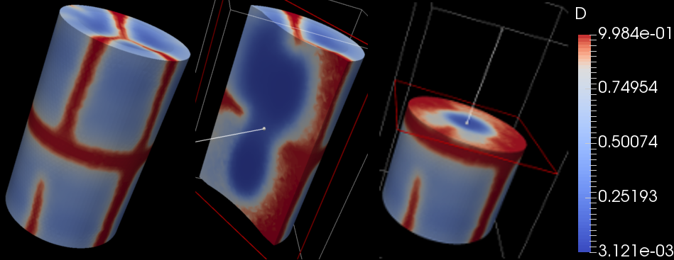
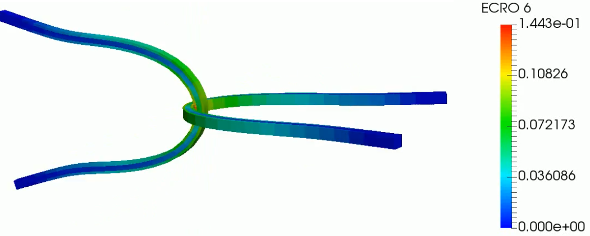
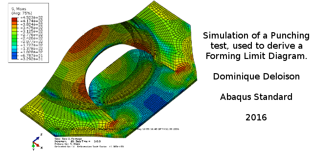
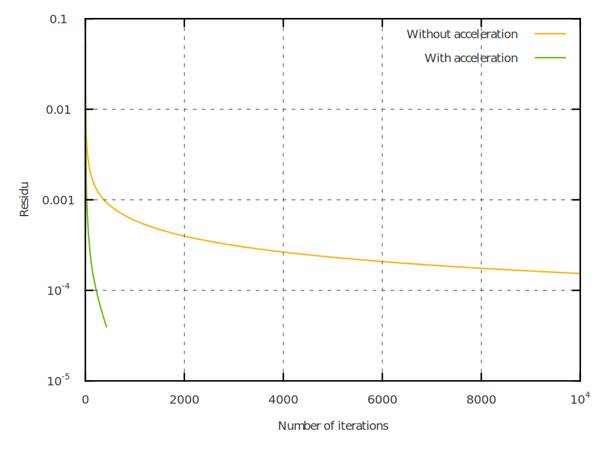

% New functionalities of the 3.0 version of `TFEL`, `MFront` and `MTest`
% Thomas Helfer, Olivier Fandeur, David Haboussa, Dominique Deloison, Olivier Jamond, Rémi Munier, Lucie Berthon, Étienne Castelier, Isabelle Ramière
% 2017

# Overview of `TFEL`, `MFront` and `MTest`

The `TFEL` project is an open-source collaborative development of the
French Alternative Energies and Atomic Energy Commission (CEA) and
Électricité de France (EDF) in the framework of the `PLEIADES`
plateform (see @marelle_new_2016). `TFEL` provides mathematical
libraries which are the basis of the `MFront` code generator and the
`MTest` solver (see
[@helfer_implantation_2015;@helfer_introducing_2015]).

`MFront` translates a set of closely related domain specific languages
into plain C++ on top of the `TFEL` library.  Those languages are
meant to be easy to use and learn by researchers and engineers and
cover three kinds of material knowledge:

- Material properties (for instance Young modulus, thermal
  conductivity, etc.)
- Mechanical behaviours.
- Simple point-wise models, such as material swelling used in fuel
  performance codes.

Authors of `MFront` paid particular attention to the robustness,
reliability and numerical efficiency of the generated code, in
particular for mechanical behaviours: various benchmarks show that
`MFront` implementations are competitive with native implementations
available in the `Cast3M` @cea_site_2016, `Code_Aster` @edf_site_2016,
`Europlexus` @cea_epx_2016, `Abaqus/Standard` , `Abaqus/Explicit`
[@dassault_abaqus_2016;@deloison_testing_2016] and `Cyrano3`
@petry_advanced_2015 solvers.

Portability is also a very important issue: a behaviour written in
`MFront` shall be usable in a solvers for which an interface
exists. For example, for finite strain analysis, each solver has
chosen a specific definition of the consistent tangent
operator. `MFront` will convert the operator provided by the user, who
is free to choose the most convenient operator to ease the
implementation effort, into the one expected by the solver. The
conversion paths currently available are depicted on Figure
@fig:FiniteStrainTangentOperatorConvertion.

{#fig:FiniteStrainTangentOperatorConvertion width=75%}

`MTest` is a tool created to perform unit-testings on the mechanical
behaviours generated by `MFront`.

## How to get `TFEL` and `MFront`

`TFEL` is distributed with the `Code_Aster` finite element solver (see
@edf_site_2016), the `Salome-Meca` plateform (see also @edf_site_2016)
and the `Material Ageing Plateform` (MAP), which is available for all
members of the Material Ageing Institute (MAI) (see
[@latourte_materials_2013;@edf_mai_2016]).

Sources of `TFEL` can be downloaded from its website (see
@cea_mfront_2016). Binaries for the `Windows` operating system which
are built upon versions of the `Cast3M` finite element solver are also
available.

# Highlights

From a user point of view, `TFEL` 3.0 brings many game-changing
features which are described hereafter:

- New mechanical behaviour interfaces to several finite element
  solvers (`Europlexus`, `Abaqus/Standard`, `Abaqus/Explicit`,
  `CalculiX`)
- The support of behaviours bricks, described below.
- The ability to simulate pipes using a rigourous finite strain
  framework in `MTest`
- The introduction of various accelerations algorithms used for
  solving the mechanical equilibrium when the consistent tangent
  operator is not available (see
  [@ramiere_iterative_2015,@castelier_using_2016]).
- The development of a stable API (application programming interface)
  in `C++` and `python` which allow building external tools upon
  `MFront` and `MTest`. This point is illustrated by the development
  by EDF MMC in the `Material Ageing Plateform` of a new
  identification tool which is particularly interesting.

{#fig:PhaseField width=75%}

Many improvements for mechanical behaviours have also been made, which
won't be detailed in this paper:

- Definition and automatic computation of elastic material properties
  from external `MFront` files.
- Support for the automatic computation of the thermal expansion and
  swelling in the mechanical behaviour.
- Better support for orthotropic behaviours with the notion of
  orthotropic convention which affects various keywords
  (`@ComputeStiffnessTensor`, `@ComputeThermalExpansion`, `@Swelling`,
  `@AxialGrowth`, `@HillTensor` etc..).
- An initial support of non local mechanical behaviours. See for
  example Figure @fig:PhaseField.
- Time steps management from the mechanical behaviour.
- Consistent tangent operator support in the `Cast3M` interface.
- Easier computations of isotropic functions of symmetric tensors
  and their derivatives.
- New material properties interfaces for various programming languages
  (`fortran03`, `java`, `GNU/Octave`).

## New interfaces

### `Europlexus`

`Europlexus` (`EPX`) is a simulation software dedicated to the
analysis of fast transient phenomena involving structures and fluids
in interaction. The program is co-owned by the French Alternative
Energies and Atomic Energy Commission (CEA) and the Joint Research
Centre of the European Commission (EC/JRC). Its development is carried
out through a Consortium involving the co-owners and so-called major
partners who are granted a complete access to the source code and
development tools (see @cea_epx_2016).

The ability to call external libraries generated by `MFront` has been
introduced in the current developpement version of `EPX`. When loading
a `MFront` behaviour, `Europlexus` automatically retrieves various
helpfull information about the mechanical behaviour:

- Number and name of material properties
- Number, names and type of internal state variables
- Number and names of external variables
- Symmetry of the behaviour (isotropy, entropy)
- etc...

This information allows to check that the material declaration is
consistent and reduces the inputs provided by the user to the bare
minimal. A similar technique is used in `Code_Aster` and `MTest` when
calling `MFront` generated behaviours.

#### Supported features

The following features are currently available:

- Support for finite strain behaviours
- Support for isotropic and orthotropic behaviours
- Automatic generation of an input file example to help the user in
  assigning a `MFront` behaviour to a material.

#### Finite strain strategies

Small strain behaviours can be embedded through finite strain
strategies: currently, `MFront` provides (see
[@edf_loi_2013;@miehe_anisotropic_2002]):

- the `FiniteRotationSmallStrain` strategy: based on the
  Green-Lagrange strain measure.
- the `MieheApelLambrechtLogarithmicStrain` strategy based on the
  lagrangian Hencky strain measure.

In both cases, the strain measure is computed before calling the
behaviour and the stress tensor resulting from the behaviour
integration is interpreted as the dual of this strain measure. This
stress tensor is then converted into the Cauchy stress tensor for
computing the nodal forces.

#### Performances

{#fig:epx width=75%}

Figure @fig:epx shows a simple test simulating the impact of two
bars.

| Behaviour                                  | Computational times |
|:------------------------------------------:|:-------------------:|
|native     	                             | 174s                |
| MFront FiniteRotationSmallStrain           | 232s                |		
| MFront ImplicitSimoMieheElastoPlasticity   | 250s                |
| MFront MieheApelLambrechtLogarithmicStrain | 528s                |
: Example of comparison of the computation times for the test depicted
on Figure @fig:epx for various behaviours describing istropic
plasticity with linear isotropic hardening. {#tbl:epx}

This tests show that, for simple behaviours describing isotropic
plasticty, `MFront` behaviours seems a bit less efficient than Fortran
built-in implementations, as reported on Table @tbl:epx. However, it
shall be stated that the behaviours tested are not strictly equivalent
(native behaviours are based on objective stress rates while `MFront`
ones are hyperelastoplastic). `MFront` computational times can be
improved by keeping some intermediate results for one step to the next
to the expense of memory usage.

This interface is fully described here:
<http://tfel.sourceforge.net/epx.html>

*Acknowledgements* This work was accomplished within the framework of
the "dynamique rapide" project, financially supported by the CEA
and EDF.

### `Abaqus/Standard`, `Abaqus/Explicit` and `CalculiX`

The `Abaqus` Unified FEA product suite provides:

- an implicit finite element solver, called `Abaqus/Standard`,
  which can be extended using the `umat` subroutine.
- an explicit finite element solver, called `Abaqus/Explicit`,
  which can be extended using the `vumat` subroutine.

`MFront` provides an interface for these two solvers and strives to
allow the user restart a computation while switching from one solver
to the other: a feature which is not easy to implement as these
solvers use different conventions and, by default, different
kinematics assumptions.

The `Abaqus/Standard` interface can also be used to extend the
`CalculiX` finite element solver (see @dhondt_calculix_2016).

#### Calling `MFront` behaviours from `Abaqus/Standard` or `Abaqus/Explicit`

Calling a behaviour from `Abaqus/Standard` or `Abaqus/Explicit` is a
two steps process:

- Compiling a `MFront` library before launching either
  `Abaqus/Standard` or `Abaqus/Explicit`. This allows the creation of
  a set of libraries that can be shared between co-workers (for
  example, by copying them in shared folders).
- Launching `Abaqus/Standard` or `Abaqus/Explicit` with a general
  purpose `umat` or `vumat` subroutine which handles the loading of
  the `MFront` library and the call of the appropriate behaviour. The
  material name as declared in the input file must contains the name
  of the library and the name of the behaviour and the modelling
  hypothesis.

#### Features supported

For every behaviour, example of input file are automatically
generated.

The `MFront` interface for the `Abaqus/Standard` solver supports
orthotropic and isotropic, small and finite strain behaviours. For
isotropic behaviours written in the small strain framework, internal
state variables are automatically and properly rotated in finite
strain analyses.

Concerning `Abaqus/Explicit`, we support orthotropic and isotropic
finite strain behaviours.

In both cases, we offer three finite strain strategies to use small
strain behaviours implementations in finite strain:

- The `Native` one which uses `Abaqus` native strategy to handle
  behaviour written in rate-form.
- The `FiniteRotationSmallStrain` strategy (see @edf_loi_2013).
- The `MieheApelLambrechtLogarithmicStrain` strategy
  (see @miehe_anisotropic_2002).

#### Performances

In `Abaqus/Standard`, our tests show that the performances of `MFront`
generated behaviours are on par with native behaviours (even slightly
better in some cases): those results were quite surprising because we
expected the manual handling of the external libraries at the Gauss
point level to be a performance bottleneck.

{#fig:abaqusFLD width=465px height=240px}

| Implementation     | Computational times |
|:------------------:|:-------------------:|
|Native     	     |    638s             |
|`VUMAT` (`Fortran`) |    762s             |
|`MFront`            |    788s             |
: Comparison of computational times for a simple isotropic plasticity
behaviour with linear kinematic hardening applied to the punching test
depicted on Figure @fig:abaqusFLD. {#tbl:abaqusexplicit}

In `Abaqus/Explicit`, we found that our implementations are about
\(20\,\%\) slower than the native ones on the simulation of the
punching test depicted on Figure @fig:abaqusFLD for an isotropic
plastic behaviour with linear isotropic hardening. However, our
implementations are nearly equivalent to `VUMAT` implementations
described in @abaqus_vumat_2016 (see Table @tbl:abaqusexplicit). This
difference can have several explanations:

- the `VUMAT` implementation is based on an update of the stresses
  whereas the `MFront` implementation keeps the elastic strain as an
  internal state variable.
- the `VUMAT` implementation is compiled using the `INTEL` compiler
  and the `MFront` implementation is compiled with `gcc`.

#### Additional documentations

A dedicated page has been created describing the current features of
these interfaces, the potential pitfalls, and the choices that were
made to support some behaviours, for example orthotropic finite strain
behaviours: <http://tfel.sourceforge.net/abaqus.html>

A specific talk of the Second MFront User Day has been dedicated to
those interfaces (see @deloison_testing_2016).

## Behaviour bricks

Behaviour bricks allow the use of predefined parts of a behaviour.

For example, the `StandardElasticity` brick handles:

- The computation of the stress according to the Hooke law, taking
  into account the evolution of the elastic material properties if
  necessary.
- The computation of an elastic prediction of the stresses, taking
  into account the modelling hypothesis.
- The computation of the tangent operator.
- The computation of a minimal prediction operator.
- The computation of the stored and dissipated energy.
- The additional equations associated with the plane stress and
  generalised plane stresss modelling hypotheses support.

This brick works with isotropic of orthotropic small-strain behaviours
implemented using the `Implicit` domain specific language.

The use of bricks leads to much smaller, more robust and more portable
implementations of mechanical behaviours. The user can focus on the
specific parts of the behaviour. Listing [@lst:norton] shows how a
implicit implementation with analytical jacobian of the Norton
behaviours can now be written in about 25 lines of codes (without the
blank and comment lines).

~~~~ {#lst:norton .numberLines .cpp caption="Implicit implementation of the Norton behaviour"}
@DSL Implicit;
@Behaviour ImplicitNorton;
@ModellingHypotheses {".+"};
@Brick   StandardElasticity;
@Epsilon 1.e-16;

@ElasticMaterialProperties {150e9,0.3};

@StateVariable strain p;
p.setGlossaryName("EquivalentViscoplasticStrain");

@Parameter A = 8.e-67;
A.setEntryName("NortonCoefficient");
@Parameter E = 8.2;
E.setEntryName("NortonExponent");

@Integrator{
  const auto seq  = sigmaeq(sig);
  if(seq>1.e-8*young){
    const auto n    = 3*deviator(sig)/(2*seq);
    const auto tmp  = A*pow(seq,E-1);
    const auto df_dseq = E*tmp;
    feel += dp*n;
    fp   -= tmp*seq*dt;
    // jacobian
    dfeel_ddeel += (2*mu*theta*dp/seq)*(Stensor4::M()-(n^n));
    dfeel_ddp    = n;
    dfp_ddeel    = -2*mu*theta*df_dseq*dt*n;
  }
} // end of @Integrator
~~~~~

The following bricks are available:

- `StandardElasticity` which have been shortly described earlier.
- `FiniteStrainSingleCrystal` which can be used to hide many details
  about the classical \(F_{e}F_{p}\) formalism used in the
  implementations of finite strain single crystal behaviours (see
  @hure_intergranular_2016).
- `DDIF2` which describes a damage model widely used in CEA nuclear
  fuel behaviours (see [@michel_3d_2008;@michel_3d_2016]).

## Pipe Modelling in `MTest`

Most mechanical behaviours available for the cladding are identified
on tests where a pipe is submitted to an internal pressure loading.

`MTest` have been extended to describe various tests on pipes with
various axial or radial loadings using a mono-dimensional finite
strain framework described in depth in @helfer_extension_2015:

- imposed inner pressure or external pressure
- imposed external radius evolution rate, controlled through the
  internal pressure (which becomes one of the unknowns)
- end-cap effect
- imposed axial strain
- imposed axial force

This extension allows a consistent identification of the mechanical
behaviour at finite strain.

| Solver             | Computational times |
|:------------------:|:-------------------:|
|MTest  (C++)	     | 0.024s              |
|MTest (python)	     | 0.071s              |
|Castem 2015 PASAPAS | 5.805s              |
: Example of comparison of the computation times for a simple test
where a pipe with a Norton behaviour is submitted to internal
pressure. The mesh size has been choosen large enough so that `MTest`
computational times become significant {#tbl:pipe}

Being very specialized, this extension leads to computational times
significantly lower than with general purpose finite element solver
(see Table @tbl:pipe).

## New acceleration algorithms in `MTest`

The `Cast3M` finite element solver does not use by default a standard
Newton-Raphson algorithm which would require the computation of the
consistent tangent operator, but relies on a quasi-Newton algorithm
using the elastic stiffness. The displacement is corrected by this
fixed point iteration:
\[
\Delta\,\mathbb{U}^{n+1}=\Delta\,\mathbb{U}^{n}-\mathbb{K}^{-1}_{\mathrm{el}}\,\cdot\,\mathbb{R}\left(\Delta\,\mathbb{U}^{n}\right)
\]

The convergence of this algorithm is greatly improved by the use of an
acceleration algorithm closed to the one introduced by Anderson (see
@anderson_iterative_1965). There is no point in discussing whether
this strategy is better than the standard Newton-Raphson algorithm, as
the answer is very sensitive to the case treated. However, we can
outline that the elastic stiffness is only decomposed once when using
the `Cast3M` strategy.

In `MTest`, systems solved are so small and the situation treated so
simple that the full Newton-Raphson algorithm is always the better
option.

However, when the consistent tangent operator is not available, the
`Cast3M` strategy can be used in `MTest`. As described by I. Ramière
(see @ramiere_iterative_2015), various acceleration algorithms were
introduced and tested in `MTest`.

{#fig:UAnderson width=75%}

Those algorithms were improved by É. Castelier to accelerate the
equilibrium iterations of the TMFFT solver (see @castelier_using_2016)
for systems with several millions of degrees of freedom (see Figure
@fig:UAnderson). They are available in `MTest` with the name
`UAnderson` and `FAnderson`. The implementations of those algorithms,
which require a special care to get accurate and reliable results, are
available as autonomous classes which can be used outside `MTest`.

## A stable API to build external tools: application to the mechanical behaviours identification developed in the MAP plateform

With version 3.0.x, `MFront` and `MTest` now provide stable API in
`C++` and `Python` upon which external tools can be built.

This is illustrated by the recent development by EDF of an
identification tool, called `c_solver_constitutive_law_0d`, in the
`Material Ageing Plateform` (MAP) based on:

- `MFront` to generate the mechanical behaviour. The `MFront` `python`
  module is used to extract information about the behaviour, such as
  the parameters that has to be identified.
- `MTest` to perform simulations on simple mechanical tests such as
  tensile tests or tests on pipe as described earlier. More complex
  simulations requires a fully-fledge finite element solver such as
  `Code_Aster` or `Cast3M`. `MTest` is used through its `python`
  module.
- `ADAO` for parameters optimisation. `ADAO` is a specific software
  dedicated to data assimilation and distributed in the platform
  `Salome` (see @argaud_reconstruction_2014).

This identification tool, co-developed by two departments of EDF R\&D
(SINETICS and MMC), is a central part of the material knowledge
management of the MAP plateform and thus addresses the following
issues:

- Ease of use by engineers without advanced programming skills.
- Provide a robust and reliable identification of mechanical
  behaviours.
- Guarantee a consistent approach of the identification process and
  the behaviour usage in engineering studies. In particular, its is
  the same implementation that will be used in the identification
  process and the engineering simulations.
- Maintainability and tracability. EDF wants to guarantee that the
  identification process of each behaviour used in engineering studies
  can be replayed for years.
- Integration in the EDF material knowledge database (called `CADEEX`)
  which stores every information from the material specification, the
  measures, the thermal treatments, the experimental data and the
  identification process and finally the mechanical behaviour
  implementation. This integration is currently under heavy
  developments.

Though relatively young - it has been developed for one year now -,
this tool gives quite promising results, as discussed during the
MFront users day (see @munier_identification_2016).

This ambitious project highlights the need for high quality coding
standards for `TFEL`, `MFront` and `MTest`. This point is discussed in
depth in the following section.

# An industrial strength software

The version 3.0.x is based on the C++11 standard. This implied a major
code refactoring. In particular, the expression template engine was
greatly simplified and is now much more reliable and maintainable.

## Systems supported

Version 3.0.x of `TFEL/MFront` will be available on the following
systems:

- `LiNuX`
- `Windows`. The port to `Visual Studio 2015` is the first step toward
  an industrial strength support of this platform. However, due to the
  very nature of this platform, a direct use of `MFront` is
  discouraged. One shall consider creating a material knowledge
  management project based on `cmake` to build material librairies.
- `FreeBSD` and `TrueOS`.

Various Unix-based systems, including `Mac Os X`, have been tested at
various stages of the development of this version and shall work out
of the box.

## Compiler support

Version 3.0.x were tested using the following compilers:

- [`gcc`](https://gcc.gnu.org/): versions 4.7, 4.8, 4.9, 5.1, 5.2, 6.1, 6.2
- [`clang`](http://clang.llvm.org/):  versions 3.5, 3.6, 3.7, 3.8, 3.9
- [`intel`](https://software.intel.com/en-us/intel-compilers). The
  only supported version is the 2016 version.
  [Intel compilers 15](https://software.intel.com/en-us/intel-compilers)
  are known not to work due to a bug in the [EDG](https://www.edg.com)
  front-end that can't parse a syntax mandatory for the expression
  template engine. The same bug affects the
  [Blitz++](http://sourceforge.net/projects/blitz/) library (see
  <http://dsec.pku.edu.cn/~mendl/blitz/manual/blitz11.html>)
- [`Visual Studio`](https://www.visualstudio.com/) The only supported
  version is the 2015 version. Previous versions does not provide a
  suitable `C++11` support.

## Documentation

A vast amount of documentation has been written for `TFEL` and
`MFront`, mostly in French: (see
  <http://tfel.sourceforge.net/publications.html>).

With version \(3.0\), we followed the example of the `CMake` software
and introduced the ability to query documentation from the command
line for `MFront` and `MTest` which now provide the following options:

- `--help-keywords` which displays the help associated with all keywords.
- `--help-keywords-list` which displays the list of available
  keywords.
- `--help-keyword` which displays the help associated to a specific
  keyword.

The documentations of the keywords are now written in English and
displayed using `pandoc` markdown language.

## Code quality

Code quality is an important matter in the development of `TFEL` and
`MFront`. As an example, one may consider the number of code defects
measured by the `Coverity` analysis tool: this indicator shows that
the code is nearly as good as great open-source projects such as
`Python` and much lower that what is considered as well developed
industrial projects.

Many static analysis tools (`Coverty`, `PVS-Studio`, `cppcheck`,
`clang-tidy`) were used to improve the overall quality of the code.

### A myriad of tests

`TFEL` and `MFront` use a test-driven development scheme: each new
functionality has at least one associated test. The current version is
delivered with more than \(3\,300\) tests, each of them containing
various units-tests.

# Conclusions

This paper have highlighted the improvements made in the version 3.0
of `TFEL`, `MFront` and `MTest`. Mechanical behaviours can be written
even more easily than in previous versions and performances are
competitive with built-in behaviour implementation of most mechanical
solvers. Being mostly developed for implicit solvers, we were pleased
to see that performances obtained in explicit solvers such as
`Europlexus` and `Abaqus/Explicit` are quite decent.

The `MFront` users' community is steadily increasing outside the
nuclear industry and the french mechanical community: its use now
encompasses a wide range of materials and applications. Creation of
new interfaces is relatively easy, extensive testing is time
consuming. Every new user is thus welcomed, even with a solver which
is not currently supported yet, and everybody's contribution in the
improvement of TFEL and MFront is much appreciated.

*Acknowledgements* This research was conducted in the framework of the
PLEIADES project, which was supported financially by the CEA
(Commissariat à l’Énergie Atomique et aux Énergies Alternatives), EDF
(Électricité de France) and AREVA and in the framework of the
3M project hold within EDF R\&D.

# References

<!-- Local IspellDict: english -->
