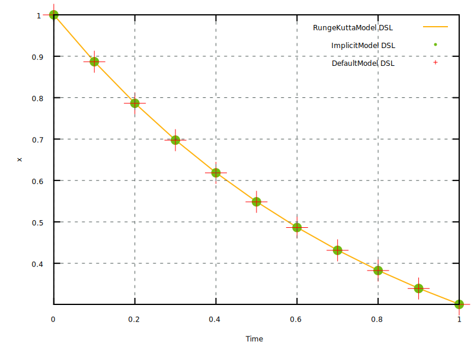

The page describes the new functionalities of Version 3.4.3 of the
`TFEL` project.

# New features of `MFront`

## Ability to implement point-wise models as a particular case of generic behaviours

Point-wise models computes the evolution of a set of state variables as
a function of the evolution of some external state variables. Examples
of point-wise models of current usage are phase transitions, swelling
models due to irradiations products, etc...

In previous versions, point-wise models were only handled by a dedicated
domain specific language called `Model`. This DSLs has its own
convention, which makes it inhomogeneous with the other DSLs, and is
acknowledgly much less powerful than DSLs associated with behaviours.

Point-wise models mostly differs from behaviours du to the fact that
they don't have no gradients and associated thermodynamic forces and do
not compute any consistent tangent operator. This difference was very
important in early versions of `MFront` which only supported small and
finite strain behaviours.

With the support of generic behaviours introduced in version 3.3 and
extended in Version 3.4,this difference appears less important and
point-wise models can be seen as a particular case of generic beahviours
without gradient (and no conjugated thermodynamic force) and tangent
operator blocks.

Version 3.4.3 introduces three new domains specific languages called
respectively `DefaultModel`, `RungeKuttaModel` and `ImplicitModel` based
on this idea. Those DSLs mostly differ from their counterparts dedicated
to generic behaviour by:

- The fact that they don't allow the declaration of gradients and
  thermodynamic forces, nor tangent operator blocks.
- The fact that their name is introduced by the `@Model` keyword and not
  `@Behaviour`.

## Resolution of simple ordinary differential equation

Let us consider the following ordinary differential equation:

\[
\dot{x}=-A\,x
\]

where \(A\) is a positive constant. The solution of this ordinary
differential equation is an exponential decay of \(x\):

\[
x\left(t\right)=x_{0}\exp\left(-A\,x\right)
\]

A numerical resolution of this equation using the `RungeKuttaModel` can
be implemented as follows:

~~~~{.cxx}
@DSL RungeKuttaModelDSL;
@Model ode_rk54;
@Author Thomas Helfer;
@Date 21 / 09 / 2021;

@Epsilon 1.e-11;

@StateVariable real x;
@Parameter frequency A = 1.2;

@Derivative {
  dx = -A * x;
}
~~~~

# New features of `MTest`

## Support for point-wise models, i.e. generic behaviours without gradient, thermodynamic force nor tangent operator block

~~~~{.cxx}
@Author Thomas Helfer;
@Date   21/09/2021;
@ModellingHypothesis "Tridimensional";
@Behaviour<generic> "src/libBehaviour.so" "ode_rk54";
// internal state variable initialisations
@InternalStateVariable "x" 1;
// external state variable
@ExternalStateVariable "Temperature" 293.15;
@Times {0, 1 in 10};
~~~~

{width=75%}

# Issues solved

## 